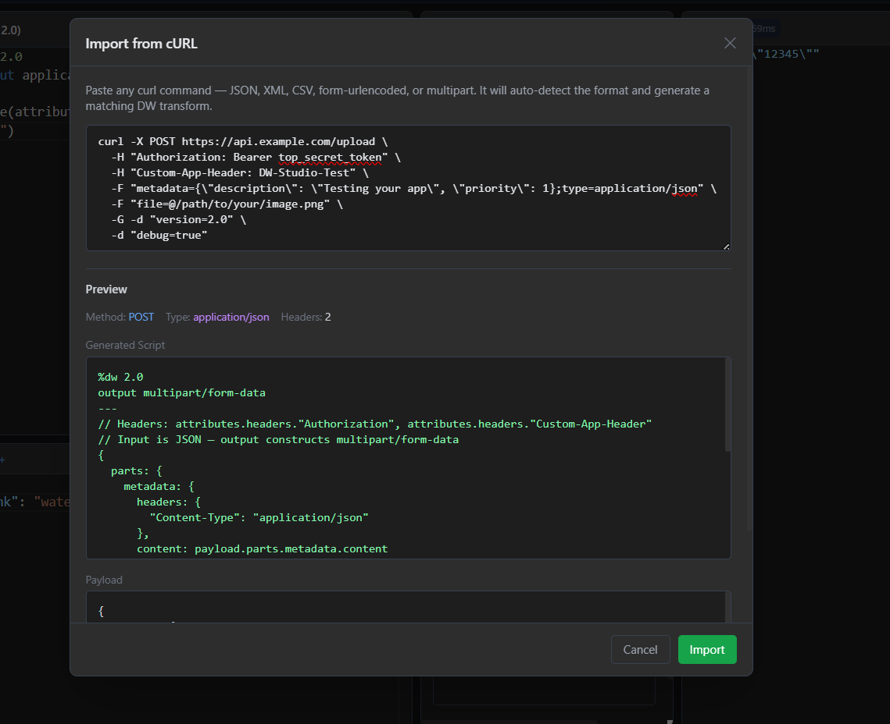
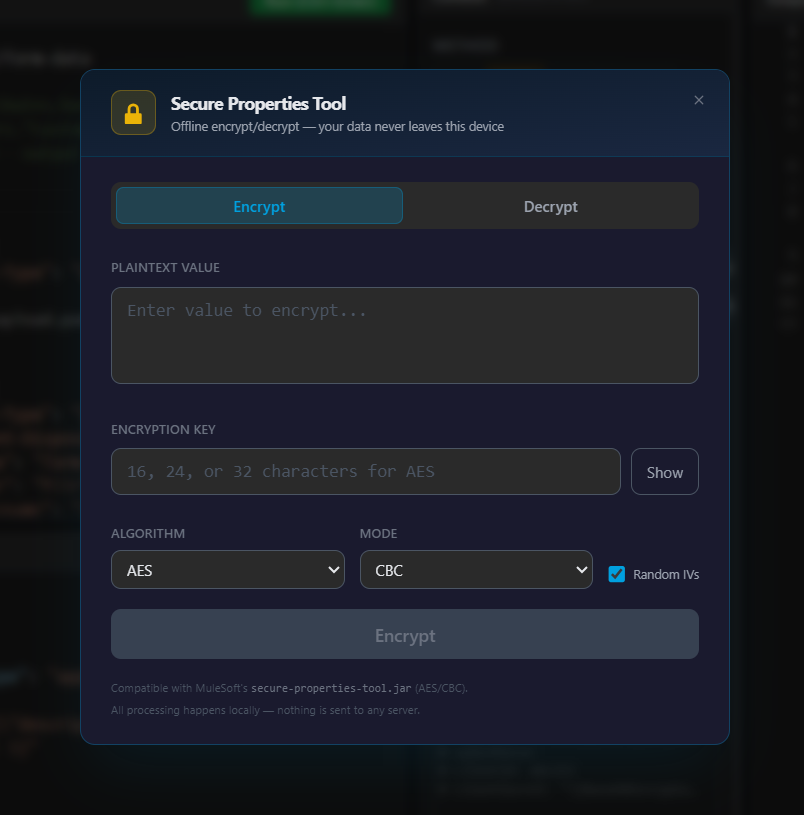

# DataWeave Studio

Run and debug DataWeave scripts locally — no Anypoint Studio, no browser limits, no nonsense.

> **Anypoint Studio is 2GB. The online playground doesn't support full context. DataWeave Studio runs locally, offline, instant.**

Built with Tauri v2 (Rust) + React + TypeScript + Monaco Editor.

---

## Preview


*Main screen — DataWeave script editor, full context panel (attributes, vars, config), and live output*


*Salesforce Query mode — write SOQL with `:param` binding, see the exact final query rendered instantly*


*cURL importer — paste any cURL command, auto-fills payload and headers, generates a matching DW transform*


*Offline Secure Properties Tool — encrypt/decrypt values locally using AES-CBC, nothing sent to any server*

---

## Why?

DataWeave testing today is painful:

- **Anypoint Studio** is 2GB, Eclipse-based, and takes minutes to start. Testing a single DataWeave script requires deploying an entire Mule app locally.
- **The online playground** lacks full execution context — no `vars`, no config properties, no real headers — and hangs or crashes on large payloads.
- **The VSCode DataWeave extension** requires a specific folder structure (`src/main/dw/inputs/`), a separate file for every input — payload, attributes, vars, each written by hand — and switches between panes just to see output. High friction for something you do dozens of times a day.

DataWeave Studio fixes all of it — one window, everything from a UI, no file management.

---

## 3 Things No Other Tool Does

**1. Test with your real secure config — offline, nothing sent anywhere**
Paste your actual `secure-config.yaml` (with `![Base64Encrypted...]` values), provide your encryption key at runtime. Your script runs with real decrypted values. The key is never saved to disk. No other DataWeave tool supports this — everywhere else you're forced to manually decrypt and hardcode values, or spin up the full Mule runtime.

**2. See your final SOQL/SQL query before it hits the connector**
Write your DataWeave SOQL builder script, run it, see the exact rendered query. No Salesforce connection, no API calls, no guessing. Catch mistakes before they hit prod.

**3. Full Mule message context from a UI — zero files**
Set `attributes.method`, `attributes.headers`, `attributes.queryParams`, `vars`, config properties, and encrypted secure config values entirely from the UI. No JSON files, no folder structures, no context switching.

---

## Who is this for?

- MuleSoft developers tired of opening Anypoint Studio just to test a script
- Engineers using the VSCode extension but fed up with maintaining input folders and hand-written JSON files just to set `vars` or `attributes`
- Anyone who needs to test scripts that reference `${secure::key}` values without running the full stack
- Anyone building or debugging DataWeave with real production payloads, headers, and config

---

## vs. The Alternatives

| Feature | Anypoint Studio | Online Playground | VSCode Extension | DataWeave Studio |
|---|---|---|---|---|
| Startup | Minutes | Instant | Instant | Instant |
| Offline | Yes | No | Yes | Yes |
| Large payload support | Yes | Hangs/crashes | Yes | Yes |
| Context (vars, attrs, headers) | Yes | Limited | Manual JSON files | UI — no files |
| Config YAML (`${key}`) | Yes | No | No | Yes |
| Secure config (`![encrypted]`) | Yes (full runtime) | No | No | Yes — offline |
| SOQL/SQL query rendering | Yes (full runtime) | No | No | Yes — instant |
| cURL import | No | No | No | Yes |
| Workspace save/load | Yes | No | Partial | Yes |
| Footprint | 2GB+ | N/A | Needs VSCode | ~150MB standalone |

---

## Installation

Download the latest installer for your platform from the [Releases page](https://github.com/Ashutosh-Vijay/DataWeave-Studio/releases):

- **Windows** — `.exe` (NSIS installer) or `.msi`
- **macOS** — `.dmg` (Intel + Apple Silicon)
- **Linux** — `.AppImage` or `.deb`

> **Note:** The app is not code-signed. On Windows, click "More info → Run anyway". On macOS, right-click → Open.

The DataWeave CLI is bundled — no separate installation needed.

---

## Features

### Context & Config
- **Full context panel** — set `attributes.method`, `headers`, `queryParams`, and `vars` from the UI
- **Config properties (YAML)** — define `${key}` and `${secure::key}` properties just like MuleSoft's `config.yaml` / `secure-config.yaml`
- **Secure property decryption** — paste your production `secure-config.yaml`, provide the key, and your script runs with real decrypted values. Key is never saved to disk.
- **Offline Secure Properties Tool** — encrypt/decrypt values locally, without sending secrets to any server

### Workflow
- **Named inputs** — add extra input streams as tabs alongside payload, accessible by name in DW scripts
- **cURL importer** — copy a request from Postman or browser devtools, paste it, get a DataWeave transform template instantly
- **Workspace management** — save/load `.dwstudio` files with full editor state
- **Auto-run** — toggle live preview with 1.5s debounce

### Editor
- **DataWeave script editor** with syntax highlighting, autocomplete, and error line highlighting
- **Context-aware autocomplete** — suggests actual field names from your payload, vars, attributes, and config properties
- **No payload size limit** — handles large Base64, nested JSON, XML, CSV locally

### Query Modes
- **Salesforce Query mode** — SOQL editor with `:paramName` binding, see the exact final query rendered before it hits Salesforce
- **DB Query mode** — SQL editor with `:paramName` parameters (auto-quoting, simulated JDBC)

---

## Privacy & Security

- **Local execution** — no code or data ever leaves your machine
- **Zero telemetry** — no tracking, no analytics, no phone-home
- **Memory-only keys** — secure encryption keys are held in memory only and never written to disk

---

## Keyboard Shortcuts

| Shortcut | Action |
|----------|--------|
| `Ctrl+Enter` | Run the current script |
| `Ctrl+S` | Save the current workspace |
| `Escape` | Close dialogs |
| Arrow keys | Navigate the welcome tour |

---

## Development Setup

```bash
# 1. Install dependencies
npm install

# 2. Download the DataWeave CLI (not included in git — ~144MB)
#    Get it from: https://github.com/mulesoft/data-weave-cli/releases
#    Extract platform binaries into:
#      src-tauri/resources/dw-cli/windows/   (dw.exe + libs/)
#      src-tauri/resources/dw-cli/macos/     (dw + libs/)
#      src-tauri/resources/dw-cli/linux/     (dw + libs/)

# 3. Run in development mode
npx tauri dev

# 4. Build for production
npx tauri build
```

---

## Project Structure

```
src/                    # React frontend
  components/           # UI components (ScriptEditor, PayloadTabs, OutputPane, etc.)
  hooks/                # useDWRunner, useWorkspace
  types/                # TypeScript types
  dataweaveGrammar.ts   # Monarch tokenizer for DW syntax highlighting
  dataweaveCompletions.ts  # Autocomplete provider with context-aware suggestions
  dataweaveTheme.ts     # Custom Monaco theme (vs-dark + config property colors)
src-tauri/              # Rust backend
  src/dw_runner.rs      # DW CLI execution engine (temp-file based, no arg length limits)
  src/workspace.rs      # Workspace save/load
  resources/dw-cli/     # Bundled DataWeave CLI binary
licenses/               # Third-party licenses
```

---

## Known Limitations

- DW CLI warmup takes a few seconds on first launch
- Undo/redo is per-session and does not persist across workspace reloads
- Config property autocomplete triggers on `$` — type `${` to see suggestions

**Mule runtime-only features are not available** — the app runs the standalone DW CLI, not a full Mule runtime. Functions and capabilities that only exist inside a deployed Mule app will not work:

| Feature | Workaround in DataWeave Studio |
|---|---|
| `output application/java` | Use `application/json` for logic testing |
| `p("key")` / `Mule.p("key")` property lookup | Use the **Config YAML** panel — `${key}` is substituted before each run |
| `Mule.lookup("flowName", payload)` | No equivalent — extract the logic into a named input or separate script |
| Connector-specific types (Salesforce `SObject`, DB `ResultSet`, etc.) | Pass a JSON mock of the data structure as payload |
| `java!` interop / Java object output | Not supported outside a Mule runtime |
| Custom Java modules via `%import java!` | Not supported — standard DW modules and JAR-based DW libraries work via classpath |

> **Secure config (`![encrypted]`) is the one exception** — DataWeave Studio implements this itself using the same AES/CBC algorithm as `secure-properties-tool.jar`, so it works fully offline without the Mule runtime.

---

## Third-Party Licenses

This application bundles the [DataWeave CLI](https://github.com/mulesoft/data-weave-cli) by MuleSoft/Salesforce, licensed under the BSD 3-Clause License. See [licenses/DATAWEAVE-CLI-LICENSE.txt](licenses/DATAWEAVE-CLI-LICENSE.txt).

DataWeave Studio is not affiliated with, endorsed by, or sponsored by MuleSoft or Salesforce.
