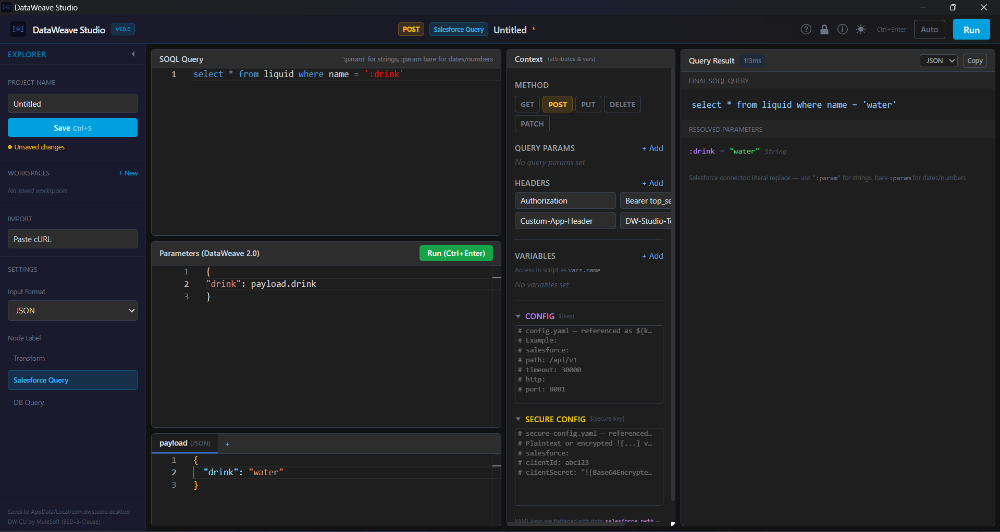
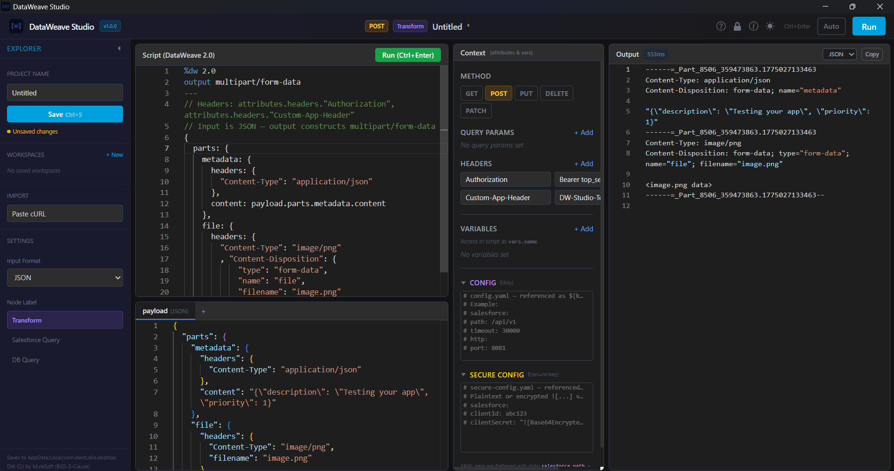

# DataWeave Studio

Run and debug DataWeave scripts locally — no Anypoint Studio, no browser limits, no nonsense.

> **Anypoint Studio is 2GB. The online playground doesn't support full context. DataWeave Studio runs locally, offline, instant.**

Built with Tauri v2 (Rust) + React + TypeScript + Monaco Editor.

---

## Preview





---

## Why?

DataWeave testing today is painful:
- Anypoint Studio is heavy, slow to start, and overkill for a quick transformation test
- The online playground lacks full execution context — no vars, no config properties, no real headers
- Debugging real-world payloads with large JSON or nested structures is clunky

DataWeave Studio fixes that.

---

## Who is this for?

- MuleSoft developers tired of opening Anypoint Studio just to test a script
- Engineers working with production payloads, secure configs, and real Mule message context
- Anyone building or debugging DataWeave outside a full Mule app

---

## vs. The Alternatives

| Feature | Anypoint Studio | Online Playground | DataWeave Studio |
|---|---|---|---|
| Startup | Minutes | Instant | Instant |
| Offline | Yes | No | Yes |
| Full Context (vars, attrs, headers) | Yes | Limited | Yes |
| Config YAML (`${key}`, `![encrypted]`) | Yes | No | Yes |
| Secure property decryption | Yes | No | Yes |
| Footprint | 2GB+ | N/A | ~150MB |

---

## Installation

Download the latest installer for your platform from the [Releases page](https://github.com/Ashutosh-Vijay/DataWeave-Studio/releases):

- **Windows** — `.exe` (NSIS installer) or `.msi`
- **macOS** — `.dmg` (Intel + Apple Silicon)
- **Linux** — `.AppImage` or `.deb`

> **Note:** The app is not code-signed. On Windows, click "More info → Run anyway". On macOS, right-click → Open.

The DataWeave CLI is bundled — no separate installation needed.

---

## Features

### Context & Config
- **Full context panel** — set `attributes.method`, `headers`, `queryParams`, and `vars` from the UI
- **Config properties (YAML)** — define `${key}` and `${secure::key}` properties just like MuleSoft's `config.yaml` / `secure-config.yaml`
- **Secure property decryption** — decrypt `![encrypted]` values from production configs using AES-CBC (key never saved to disk)
- **Offline Secure Properties Tool** — encrypt/decrypt values locally, without sending secrets to any server

### Workflow
- **Named inputs** — add extra input streams as tabs alongside payload, accessible by name in DW scripts
- **cURL importer** — paste a cURL command to auto-fill payload, headers, and generate a DW transform
- **Workspace management** — save/load `.dwstudio` files with full editor state
- **Auto-run** — toggle live preview with 1.5s debounce

### Editor
- **DataWeave script editor** with syntax highlighting, autocomplete, and error line highlighting
- **Context-aware autocomplete** — suggests actual field names from your payload, vars, attributes, and config properties
- **No payload size limit** — handles large Base64, nested JSON, XML, CSV locally

### Query Modes
- **Salesforce Query mode** — SOQL editor with `:paramName` parameter binding
- **DB Query mode** — SQL editor with `:paramName` parameters (auto-quoting, simulated JDBC)

---

## Privacy & Security

- **Local execution** — no code or data ever leaves your machine
- **Zero telemetry** — no tracking, no analytics, no phone-home
- **Memory-only keys** — secure encryption keys are held in memory only and never written to disk

---

## Keyboard Shortcuts

| Shortcut | Action |
|----------|--------|
| `Ctrl+Enter` | Run the current script |
| `Ctrl+S` | Save the current workspace |
| `Escape` | Close dialogs |
| Arrow keys | Navigate the welcome tour |

---

## Development Setup

```bash
# 1. Install dependencies
npm install

# 2. Download the DataWeave CLI (not included in git — ~144MB)
#    Get it from: https://github.com/mulesoft/data-weave-cli/releases
#    Extract platform binaries into:
#      src-tauri/resources/dw-cli/windows/   (dw.exe + libs/)
#      src-tauri/resources/dw-cli/macos/     (dw + libs/)
#      src-tauri/resources/dw-cli/linux/     (dw + libs/)

# 3. Run in development mode
npx tauri dev

# 4. Build for production
npx tauri build
```

---

## Project Structure

```
src/                    # React frontend
  components/           # UI components (ScriptEditor, PayloadTabs, OutputPane, etc.)
  hooks/                # useDWRunner, useWorkspace
  types/                # TypeScript types
  dataweaveGrammar.ts   # Monarch tokenizer for DW syntax highlighting
  dataweaveCompletions.ts  # Autocomplete provider with context-aware suggestions
  dataweaveTheme.ts     # Custom Monaco theme (vs-dark + config property colors)
src-tauri/              # Rust backend
  src/dw_runner.rs      # DW CLI execution engine (temp-file based, no arg length limits)
  src/workspace.rs      # Workspace save/load
  resources/dw-cli/     # Bundled DataWeave CLI binary
licenses/               # Third-party licenses
```

---

## Known Limitations

- DW CLI warmup takes a few seconds on first launch
- Undo/redo is per-session and does not persist across workspace reloads
- Config property autocomplete triggers on `$` — type `${` to see suggestions
- `output application/java` is not supported by the DW CLI (Mule runtime only) — use `application/json` for logic testing

---

## Third-Party Licenses

This application bundles the [DataWeave CLI](https://github.com/mulesoft/data-weave-cli) by MuleSoft/Salesforce, licensed under the BSD 3-Clause License. See [licenses/DATAWEAVE-CLI-LICENSE.txt](licenses/DATAWEAVE-CLI-LICENSE.txt).

DataWeave Studio is not affiliated with, endorsed by, or sponsored by MuleSoft or Salesforce.
