# DataWeave Studio

A local IDE for DataWeave 2.0 — run, test, and debug transforms without Anypoint Studio. Available as a **desktop app** or a **VS Code extension**.

> **Anypoint Studio is 2 GB. The playground container needs Docker Desktop, which most companies license commercially. The online playground means pasting production payloads into a website. MuleSoft's VS Code extension needs Java + Maven. DataWeave Studio bundles everything — desktop or extension — with the engine and a Java runtime built in, and never sends your data anywhere.**

Built with Tauri v2 (Rust) + React + TypeScript + Monaco Editor. Ships with a bundled JRE 17 and the DataWeave runtime — no Java install required.

**[Microsoft Store](https://apps.microsoft.com/detail/9NWD4L4J7D92)** | **[VS Code Extension](https://marketplace.visualstudio.com/items?itemName=ashutosh-vijay.dataweave-studio)** | **[Download](https://ashutosh-vijay.dev/dataweave/)** | **[Releases](https://github.com/Ashutosh-Vijay/DataWeave-Studio/releases)**

> **Also on the VS Code Marketplace.** The same engine and UI run inside a VS Code webview with a bundled Java runtime — install from the Marketplace, nothing else to set up. Handy on locked-down corporate machines where a desktop installer isn't an option. (This is *DataWeave Studio's own* extension — not MuleSoft's official one, which is what the comparisons below refer to.)

---

## Preview

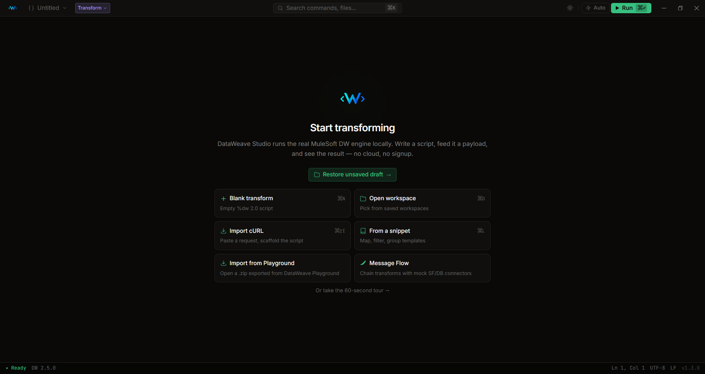
*Welcome screen — blank transform, open workspace, import cURL, snippets, message flow — all one click away*

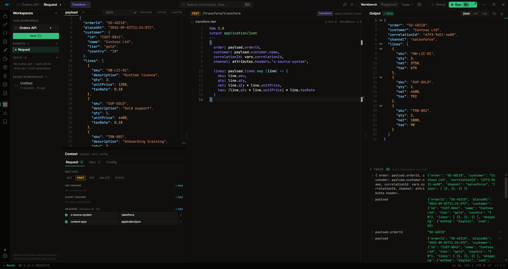
*Workbench — payload and context on the left, script in the middle, live output on the right, with every request in the workspace one click away*

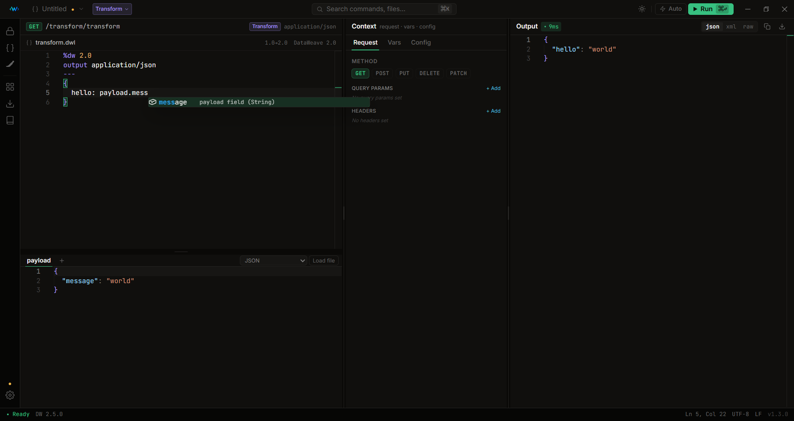
*Monaco editor with DataWeave syntax highlighting, 309-function autocomplete with signature hints, and live output*

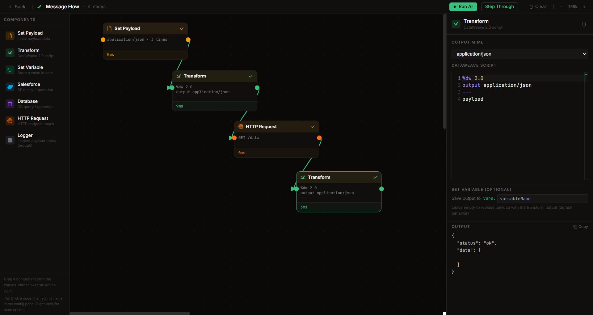
*Message Flow Designer — chain Set Payload, Transform, HTTP, Salesforce, and Database connectors with step-through debugging*

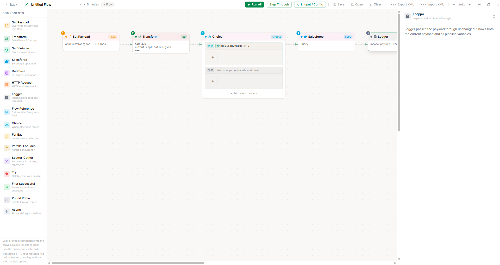
*Flow Designer in Paper (light) theme with Salesforce connector config*

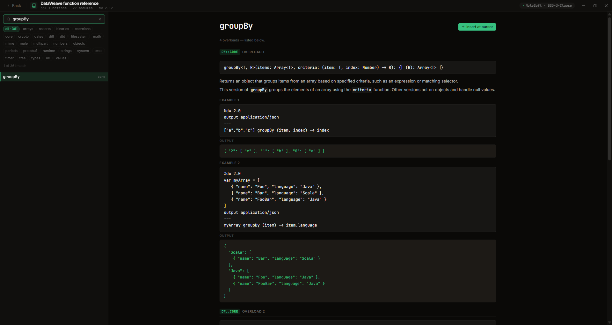
*Built-in function reference — searchable catalog of all 309 DataWeave functions with signatures and descriptions*

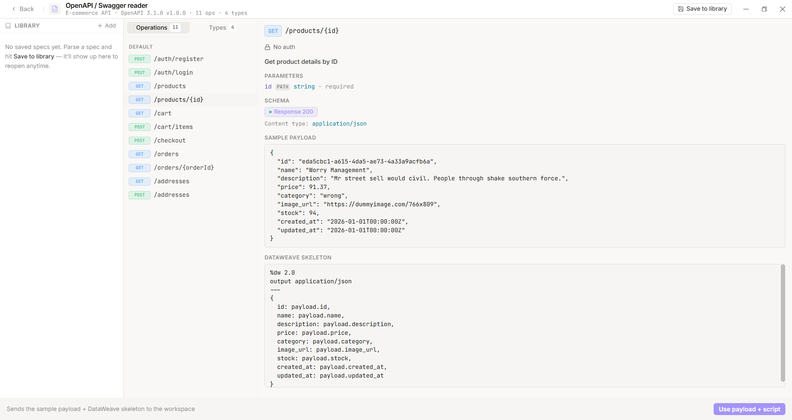
*OpenAPI / Swagger reader — open a 3.x or 2.0 spec, pick any operation, and Studio drops a sample payload and a matching DataWeave skeleton into the workspace*

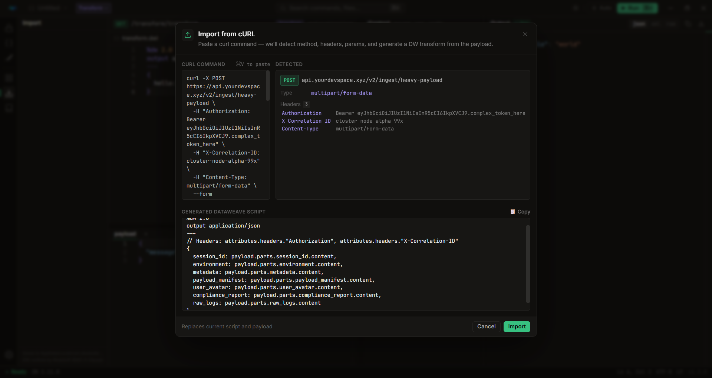
*cURL importer — paste any cURL command, auto-fills payload and headers, generates a matching DW transform*

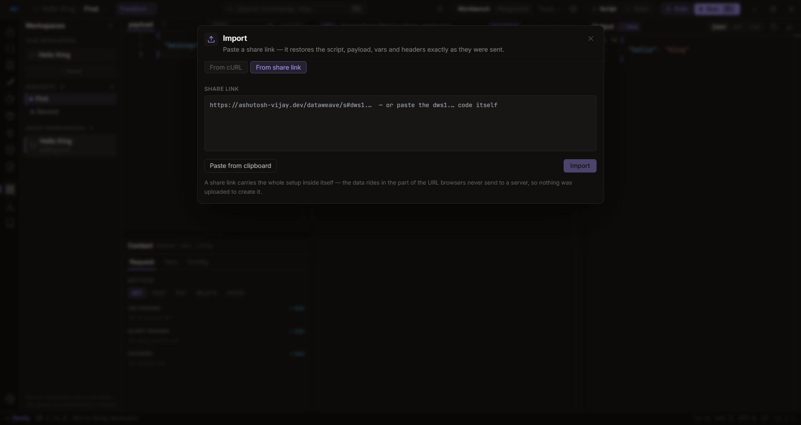
*Share links — paste a link and the whole setup comes back: script, payload, vars and headers. The data rides in the part of the URL browsers never send, so nothing is uploaded to create one*

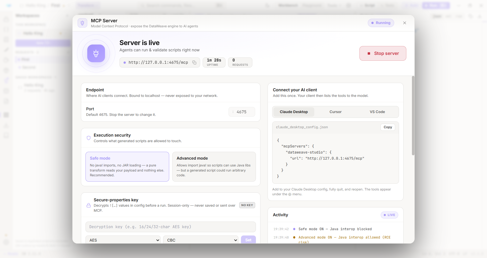
*Local MCP server — Claude, Cursor or VS Code connect over loopback and run transforms against the real engine. Safe mode blocks `java!` imports; the server is off until you start it*

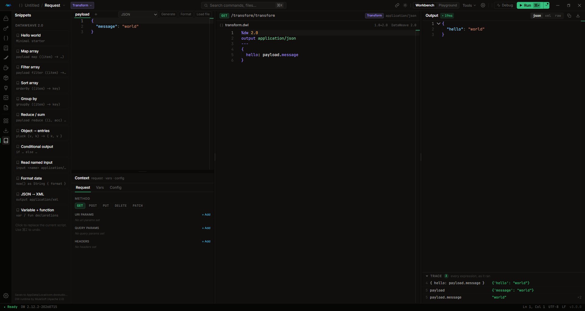
*Snippets — reusable DW templates for common patterns like map, filter, group-by, reduce*

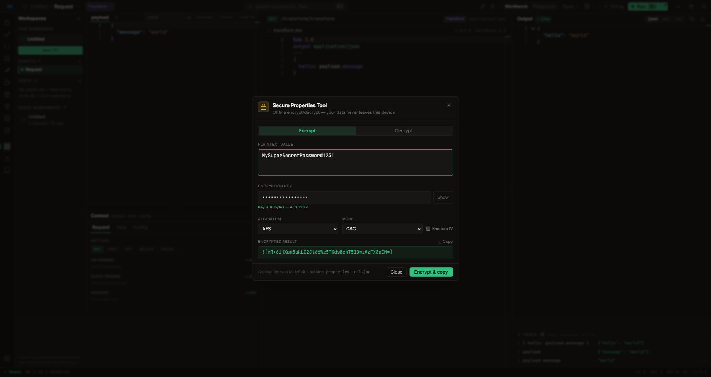
*Offline Secure Properties Tool — encrypt/decrypt values locally using AES-CBC, nothing sent to any server*

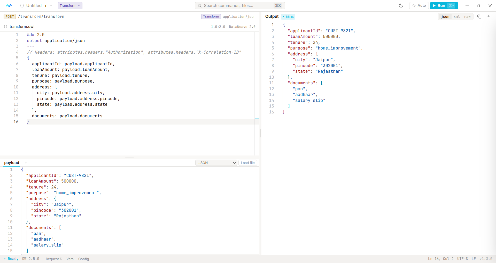
*Playground layout in Paper (light) theme — a clean three-pane Input → Script → Output view*

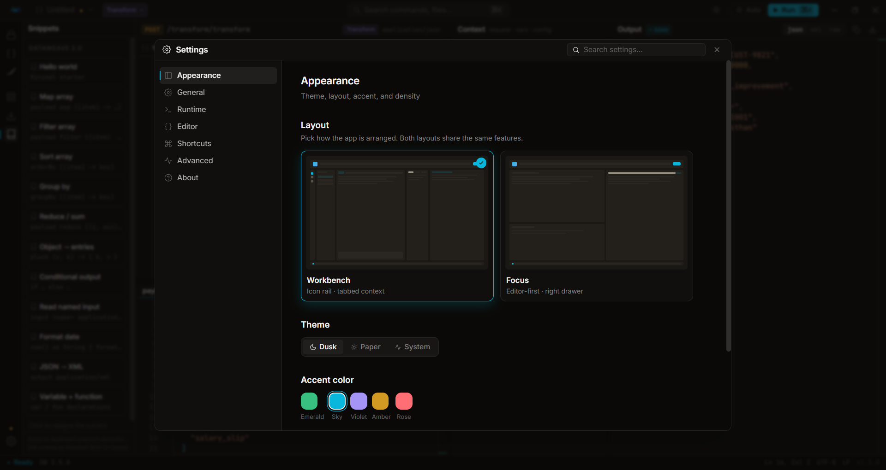
*Settings — Dusk/Paper themes, 5 accent colors, Workbench and Playground layouts*

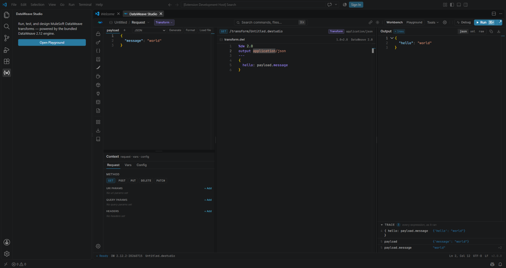
*The same app inside VS Code — bundled Java runtime, no Maven, no Anypoint Studio*

---

## Why This Exists

DataWeave testing today is painful:

- **Anypoint Studio** is 2 GB, Eclipse-based, and takes minutes to start. Testing a single DataWeave script requires deploying an entire Mule app locally.
- **The online Playground** runs in the browser (WASM) — no offline mode, no binary format support (Excel, Avro, Protobuf), payload size limited by browser memory, no version switching, no dark/light theme toggle, and no direct URL sharing of scripts.
- **MuleSoft's official VS Code extension** requires Java 8+ and Maven 3.6+ installed, a full Maven project structure (`pom.xml`, `src/main/dw/`, `src/test/dw/`), and manual scenario resource files for every input. Still in BETA after years. *(DataWeave Studio's own VS Code extension — see above — has none of these requirements; it bundles the engine and Java.)*

DataWeave Studio fixes all of it — one window, everything from a UI, no file management, no setup beyond running the installer.

---

## What Sets It Apart

### Things no other DataWeave tool does:

**1. Share a Whole Setup as One Link**
Copy a link that carries the script, payload, variables, headers and query params — one request or the entire workspace. Whoever opens it gets an identical setup and can press Run. The blob rides in the URL fragment, which browsers never send to a server, so nothing is uploaded to create one. The hosted DataWeave Playground can't do this.

**2. A Local MCP Server**
Claude, Cursor or any MCP client can compile and run transforms against the real engine over loopback — so your assistant checks its DataWeave instead of confidently inventing it. No other DataWeave tool ships one.

**3. Visual Message Flow Designer**
Drag-and-drop flow canvas inspired by Anypoint Studio. Chain Set Payload, Transform, Set Variable, HTTP Request, Salesforce, Database, and Logger connectors into a pipeline. Run all at once or step through one node at a time — inspect payload, variables, and attributes at each stage.

**4. cURL Importer**
Paste any `curl` command from Postman, browser devtools, or manual copy. Method, headers, query params, and body auto-fill. Generates a matching DataWeave 2.0 script scaffold — JSON, XML, CSV, form-urlencoded, and multipart all handled. Live preview before import.

**5. Secure Properties — Fully Offline**
Paste your actual `secure-config.yaml` (with `![Base64Encrypted...]` values), provide your encryption key at runtime. Scripts run with real decrypted values. Key is never saved to disk. Also includes a standalone encrypt/decrypt tool (AES, Blowfish, DES, DESede, RC2) compatible with MuleSoft's `secure-properties-tool.jar`.

The hosted encryption tools are websites: they go down, plenty of corporate networks block them, and pasting a production secret into someone else's web form is a bad idea even when it works. This runs locally, always.

**6. SOQL & SQL Query Modes**
Write a SOQL or SQL template with `:paramName` placeholders, run a DW script to produce a params object, see the final substituted query. JDBC-style auto-quoting for SQL. No other DataWeave tool has this.

**7. Multi-Request Workspaces**
Postman-style collections — group multiple transforms inside a single `.dwstudio` workspace. Each request has its own script, payload, context, named inputs, tests, and query template. Switch between them instantly.

**8. DW 1.0 to 2.0 Migration**
Rewrites legacy scripts in-place. Converts directives, `flowVars`, `inboundProperties`, and type syntax automatically. Diff overlay shows old vs. new with one-click replacement.

**9. Bundled Runtime — Zero Config**
Ships JRE 17 and the DataWeave runtime inside the app. No Java install, no `JAVA_HOME`, no Maven, no `PATH` changes. Download, install, run.

---

## vs. The Alternatives

| Feature | DataWeave Studio | MuleSoft VS Code Ext | Online Playground | Anypoint Studio |
|---|---|---|---|---|
| **Setup** | Download + run | Java + Maven + project scaffold | Open browser | 2 GB download |
| **Startup time** | ~1-2s (first), instant after | Depends on project indexing | Instant | Minutes |
| **Offline** | Yes | Yes | No | Yes |
| **Java required** | No (bundled JRE 17) | Yes (Java 8+ & Maven 3.6+) | No | Yes (bundled) |
| **Visual flow designer** | Yes — drag-and-drop | No | No | Yes |
| **cURL import** | Yes | No | No | No |
| **Breakpoint debugging** | Flow-level step-through | Yes (full VS Code debugger) | No | Yes |
| **Go to Definition / Rename** | Yes — engine language service | Yes (LSP) | No | Yes |
| **Type inference** | Yes — engine language service | Yes (LSP) | No | Yes |
| **Target an older Mule runtime** | Yes — set once, 4.1 to 4.12 | No | No | Per project |
| **Autocomplete** | 309 functions + type-aware fields from your payload | LSP, type-aware | Basic suggestions | Full LSP |
| **Context (vars, attrs, headers)** | UI — no files | Manual JSON scenario files | Partial | Full runtime |
| **Config YAML (`${key}`)** | Yes | No | No | Yes (full runtime) |
| **Secure config (`![encrypted]`)** | Yes — offline | No | No | Yes (full runtime) |
| **SOQL/SQL query rendering** | Yes | No | No | Yes (full runtime) |
| **Testing** | Unit tests (`dw::test`), run in-app | Unit tests (`dw::test`) | No | MUnit |
| **Multi-request workspaces** | Yes (Postman-style) | One mapping per file | No | Per-flow |
| **Multipart form-data** | Visual builder | No | No | Yes (full runtime) |
| **DW 1.0 → 2.0 migration** | Yes | No | No | Yes |
| **Binary formats (xlsx, avro)** | Yes (file picker) | Yes (via Maven deps) | No | Yes |
| **Publish to Exchange** | No | Yes | No | Yes |
| **Dependency management** | Custom classpath | Maven (pom.xml) | No | Maven |
| **Interactive tutorials** | Guided tour | No | Yes (step-by-step) | No |
| **Themes** | Dusk + Paper + 5 accents | VS Code themes | Fixed dark | Dark only |
| **Footprint** | ~90 MB | VS Code + Java + Maven | N/A (browser) | 2 GB+ |
| **Live preview** | Auto-run (toggle) | AutoPreview (opt-in) | Always on | No |
| **Execution time display** | Yes (ms) | No | No | No |
| **Cancel running script** | Yes | No | No | No |
| **Configurable timeout** | Yes | No | No | No |

**In short:** Studio sits between the Playground and MuleSoft's VS Code extension. More powerful than the Playground (offline, testing, binary formats, real config). More convenient than MuleSoft's extension (no Java/Maven, no project scaffolding, everything in one window). Unique features like cURL import, Flow Designer, query modes, and secure properties that neither has. And it ships as its own VS Code extension too — same power, inside the editor.

---

## Features

### Script Editor (Monaco)
- DataWeave 2.0 syntax highlighting with custom Monarch tokenizer
- **309-function autocomplete** with signature hints and module grouping
- **Type-aware completion from the engine itself** — `payload.` lists the fields your payload actually has, and inside a `map` the lambda parameter resolves to the element type, so `item.` suggests that element's own fields. This is the DataWeave language service inside the bundled engine, so the types are the engine's truth rather than a guess made from your sample.
- **Hover for inferred types** and signature help showing which argument you're on
- **Go to Definition** (F12), **Find All References** (Shift+F12) and **Rename Symbol** (F2), resolved through the engine's scope graph — so a name shadowed in an inner scope is correctly left alone rather than blindly text-replaced
- **Outline** (Ctrl+Shift+O) and code folding driven by the parsed AST, not by indentation
- **Live type diagnostics** — a typo-ed function, an undefined variable, a wrong argument count or a syntax error is underlined as you type, before you ever press Run
- Context-aware suggestions from variables, attributes, and config properties
- Error highlighting with line markers and gutter glyphs — auto-scrolls to the failing line
- **Code formatting (Alt+Shift+F)** using the engine's own formatter — the same one Anypoint Studio uses — plus a Format button for JSON and XML payloads
- Bracket pair colorization
- Auto-closing brackets/quotes, smart indentation
- Configurable font family, font size, line height, tab size, word wrap
- Minimap toggle

### Payload & Input Management
- **14+ MIME types** — JSON, XML, CSV, YAML, NDJSON, plain text, form-urlencoded, DataWeave, Java properties, Excel, Avro, Protocol Buffers, Flat File (COBOL copybooks), binary
- Load file into payload via native file picker
- **Named inputs** — add extra input streams as tabs (e.g., `lookup`, `config`, `schema`), each with its own editor and MIME type
- **Multipart form-data builder** — add/remove parts visually with name, content-type, and text or file value; real MIME boundaries constructed in Rust
- Binary payload support (`application/octet-stream`) with no size limit

### HTTP Context Panel
- HTTP method selector (GET, POST, PUT, DELETE, PATCH) — exposed as `attributes.method`
- Query parameters editor with key/value pairs and enable/disable toggles
- Headers editor with key/value pairs and enable/disable toggles
- Variables panel with type picker (string or JSON) and per-row enable/disable

### Configuration
- **Config YAML** — paste `application.yaml` style config, resolve `${key}` placeholders in script and payload
- **Secure Config YAML** — supports `![Base64Value]` encrypted notation, resolve `${secure::key}` placeholders
- Nested dot-notation keys (e.g., `${salesforce.username}`)
- Encryption settings per workspace: algorithm, mode, random IV toggle

### Secure Properties Tool
- Standalone encrypt/decrypt dialog (Cmd/Ctrl+Shift+E)
- **5 algorithms**: AES, Blowfish, DES, DESede, RC2
- **4 modes**: CBC, CFB, ECB, OFB
- Random IV toggle for AES
- One-click copy of result
- Fully offline — compatible with MuleSoft's `secure-properties-tool.jar`

### Message Flow Designer
- Visual drag-and-drop canvas for pipelining connectors
- **7 node types**: Set Payload, Transform, Set Variable, HTTP Request, Salesforce, Database, Logger
- Run all nodes at once or **step through individually** — inspect payload, variables, and attributes at each stage
- Variables carry through the pipeline (Set Variable stores into `vars`)
- Per-node Monaco editors with syntax highlighting and autocomplete
- Disable/enable nodes without deleting
- Canvas zoom (Ctrl+scroll or +/- buttons)
- Saved with workspace

### Sample data
No input to test against? Generate one. If your script declares types, the
**Generate** button in the input pane builds a realistic payload from any of
them — the engine's own generator is field-name aware, so `email` gets a
plausible address, `phone` a formatted number, `creditCard` a valid-shaped PAN
and a `DateTime` a real timestamp. Preview it, re-roll it, then apply it.

### Target runtime
The engine bundled here is DataWeave 2.12 (Mule 4.12). If you deploy somewhere
older, a script can work here and fail there — `logInfo` needs 2.10, the `update`
operator needs 2.3, and around 30 of the 309 standard-library functions did not
exist in 2.4.

You're asked once, when you first set the app up, and the answer is remembered
for everything you do. Change it anytime from the toolbar next to Run, or in
Settings &rarr; Runtime. The default is "latest", which checks nothing.

It's one app-wide setting rather than a per-workspace one, because which Mule
you deploy to is a fact about you, not about one script — being asked again in
every new workspace would be noise. If you genuinely straddle two runtimes,
Settings &rarr; Runtime has a **Set it per workspace** toggle.

Once set, the engine checks against it:

- **Functions and syntax newer than the target become errors**, with the version
  that introduced them named in the message — the same `@Since` metadata
  MuleSoft's own runtime uses, not a table we maintain
- **Version-dependent behaviour reverts too**, so the answer matches. For
  instance `[3, "a", true] orderBy $` fails as `InvalidComparisonException` on
  2.12 but `InvalidBooleanException` on 2.9
- Applies to Run, the Tests panel, and the editor's live diagnostics, so you see
  it while typing rather than after deploying
- Travels in share links, so "this breaks on 4.4" is reproducible by whoever
  opens it — though it only takes effect for them if they've turned on
  per-workspace targets, since otherwise their own app-wide setting wins. The
  toast that opens the link says so

Note that the `%dw 2.4` header does **not** do this — the runtime only checks
that header against its own version and otherwise ignores it. The target is a
separate setting.

### Query Modes
- **Salesforce Query (SOQL)** — write SOQL with `:paramName` template syntax, bind parameters from DW script output, see the final rendered query
- **DB Query (SQL)** — SQL with `:paramName` parameters and JDBC-style auto-quoting (strings quoted, numbers bare, `null` → `NULL`)
- Per-label script caching — switching between Transform / SOQL / SQL restores the previous script for that mode

### Testing
- **Real `dw::test` suites**, executed by the bundled engine — the same framework
  MuleSoft ships, not a lookalike. `dw::test::Tests`, `dw::test::Asserts` and
  `dw::io::file` are compiled into the server jar, so nothing needs installing
- Named assertions with the engine's own failure messages
  (`Expected value to be 3 but was 2`), rather than a diff you have to read yourself
- **Per-test status and timing**, with nested `describedBy` blocks shown as a tree
- **Source locations on failures** — the report says which line the assertion was on
- Suites are ordinary DataWeave, so they run through the same engine path as the
  Run button and behave identically

> `dw::test` exercises **functions**, so a suite either defines what it tests inline
> or imports from the Module library. Earlier builds had a snapshot runner here
> instead — it compared output against a captured blob, which mostly told you the
> capture had gone stale. Snapshot data in existing workspaces is preserved on load
> and save, it is simply no longer read.

### cURL Importer
- Paste any `curl` command (from Postman, browser devtools, or manual)
- Auto-extracts method, headers, query params, body
- Format detection: JSON, XML, CSV, form-urlencoded, multipart
- Generates matching DataWeave 2.0 script scaffold
- Multipart `-F` flag handling — parses part names, types, file paths
- Live preview before import

### OpenAPI / Swagger Reader
- Open or paste an **OpenAPI 3.x** or **Swagger 2.0** spec (JSON or YAML) — fully offline
- Browse operations grouped by tag, plus the reusable schema (type) catalog
- Resolves `$ref`s, `allOf`/`oneOf`/`anyOf`, enums, formats, and surfaces auth, servers, webhooks & callbacks
- Pick any request, response, or named **example** (every scenario, not just the first) → generates a sample payload + a DataWeave skeleton you can drop into the workspace
- **Spec library** — save specs you use often and reopen them from the sidebar in one click; rename or remove anytime (stored locally, nothing leaves your machine)

### Share Links
- **Copy a whole runnable setup as one link** — script, payload and MIME, variables, headers, query params, method, named inputs and in-memory multipart parts
- Two scopes: **this request** or **the whole workspace** (every request travels, each with its own script, payload and context)
- The blob rides in the **URL fragment**, which browsers never send to a server — a link can go over Slack or email and the payload still never touches anyone's infrastructure, including ours
- Paste one back under **Import → From share link** (Cmd/Ctrl+Shift+I), alongside the cURL importer
- Content that physically cannot travel (anything backed by a local file path) is **named in the copy confirmation** rather than silently dropped
- Payloads too large to survive chat clients refuse a link and point at the Playground zip export instead
- Opening a link on the web shows a rendered preview of every request, so a recipient without the app still sees something useful

### Local MCP Server
- **Plain HTTP too — `POST /run` on the same port**, for when you want the engine but not an MCP client:
  ```bash
  curl -X POST http://127.0.0.1:4675/run -H 'Content-Type: application/json'     -d '{"script":"%dw 2.0
output application/json
---
{ n: sizeOf(payload) }","payload":[1,2,3]}'
  ```
  Send a `rows` array instead of `payload`/`vars` to run **one script over many inputs** and get one result per row — a back-test over a CSV export of production data, without standing up an API endpoint just to exercise a transform. The engine compiles once and caches, so the first row costs ~1s and the rest run in ~15ms each.
- Serves the **Model Context Protocol** over HTTP on loopback (`127.0.0.1`) so Claude, Cursor or any MCP client can use the real engine
- Tools for validating and running DataWeave, so an assistant **checks** its transform instead of guessing at syntax
- Bound to loopback and started only when you start it — from the MCP panel in the left rail
- Safe mode rejects `java!` imports; custom modules passed by a client are scanned before use

### Recipes & Cookbook
- Searchable recipe browser with runnable examples, each opening into a workspace with its payload and variables already seeded
- Includes **MuleSoft's official cookbook examples**, generated from `mulesoft/docs-dataweave` (BSD-3) rather than hand-written
- Every generated recipe was **executed against the bundled engine** and kept only if it runs, with the engine's own output as the expected result
- `npm run docs:refresh` re-pulls the reference, format options and cookbook from the upstream docs branch matching the bundled engine

### Compare
- Side-by-side diff of two payloads or two flow XMLs
- **Ignore IDs toggle** — blanks `doc:id` and UUID values on both sides before diffing, so Anypoint Studio's id churn doesn't bury the real change
- Masks a copy rather than the text you pasted; panes go read-only while it's on so nothing can overwrite your content
- Normalize and swap helpers

### Java Interop & Custom Modules
- **Java tester** — paste or pick `.java` sources, compile and run them against the bundled JRE, and call them from DataWeave with `import java!`
- Managed JARs stored in app data, added to the engine classpath
- **Module library** — write reusable `.dwl` modules and `import x from MyModule` across workspaces; each module set gets a fresh classloader

### Workspace Management
- **`.dwstudio` format** (v2) — JSON files with full project state
- **Multi-request collections** — multiple transforms per workspace (Postman-style)
- Per-request state: script, payload, context, named inputs, query template, classpath, timeout, tests
- Save / load / duplicate / delete workspaces
- Pin frequently used workspaces in the sidebar
- Resume last workspace on launch
- **Draft auto-save** to localStorage on every keystroke (debounced 500ms)

### Snippets Library
12 built-in templates: hello world, map array, filter array, sort, group by, reduce/sum, pluck (object → entries), conditional output, read named input, format date, JSON → XML, variable + function. Click to insert at cursor.

### Function Reference Browser
Searchable catalog of all 309 DataWeave functions with signatures, descriptions, and module grouping. Click to insert function name at cursor. Lazy-loaded for performance.

### DW 1.0 → 2.0 Migration
Rewrites legacy scripts in-place. Converts `%dw 1.0` directives, `flowVars`, `inboundProperties`, and type syntax. Diff overlay shows changes side-by-side with one-click replacement.

### Execution Engine
- **Long-lived Java server** — not CLI subprocess per run. ~10-50ms per execution after warm-up.
- 64-entry LRU compile cache — repeated scripts skip recompilation
- Background JVM warm-up on startup (hidden behind splash screen)
- Configurable per-run timeout (default 30s, 0 = unlimited)
- Cancel running scripts (kill by PID)
- Execution time display in milliseconds
- Custom classpath — add JARs and directories for `import java!` resolution

### Output
- Monaco editor with syntax highlighting
- Format toggle: JSON (pretty-printed) / XML / Raw text
- Error display with DW error codes, headline, details, and collapsible stack trace
- Mapped error line numbers (de-offset from auto-generated header lines)
- Copy to clipboard
- Export to file (native save dialog)

### Appearance & Layout
- **Dusk** (dark) and **Paper** (light) themes with custom DataWeave syntax highlighting
- **5 accent colors**: Emerald, Sky, Violet, Amber, Rose
- **Workbench layout** — sidebar + the Input/Context → Script → Output panes, with resizable splits and the Tests view
- **Playground layout** — the same Input/Context → Script → Output flow without the sidebar; a clean three-pane view like the online DataWeave playground
- Responsive compact mode at ≤720px viewport width
- Custom title bar with window controls
- Configurable editor font, size, line height, tab size, word wrap, bracket guides

### Command Palette & Shortcuts
Quick access to all actions via **Cmd/Ctrl+K**. Grouped commands: Run, Workspace, Editor, View, Output, Node Label, Tools.

---

## Keyboard Shortcuts

| Shortcut | Action |
|---|---|
| `Ctrl+Enter` / `Cmd+Enter` | Run script |
| `Ctrl+S` / `Cmd+S` | Save workspace |
| `Ctrl+K` / `Cmd+K` | Command palette |
| `Ctrl+N` / `Cmd+N` | New workspace |
| `Ctrl+O` / `Cmd+O` | Open workspace |
| `Ctrl+D` / `Cmd+D` | Duplicate workspace |
| `Ctrl+B` / `Cmd+B` | Toggle sidebar |
| `Ctrl+L` / `Cmd+L` | Snippets |
| `Ctrl+Shift+I` / `Cmd+Shift+I` | Import cURL |
| `Ctrl+Shift+E` / `Cmd+Shift+E` | Secure Properties Tool |
| `Ctrl+Shift+R` / `Cmd+Shift+R` | Toggle auto-run |
| `Ctrl+Shift+T` / `Cmd+Shift+T` | Toggle theme |
| `Ctrl+Shift+1` / `Cmd+Shift+1` | Workbench layout |
| `Ctrl+Shift+2` / `Cmd+Shift+2` | Playground layout |
| `Alt+Shift+F` | Format script |
| `Ctrl+.` / `Cmd+.` | Cancel running script |
| `Ctrl+/` / `Cmd+/` | Show shortcuts |
| `Escape` | Close dialogs |

---

## Installation

**On Windows, install from the [Microsoft Store](https://apps.microsoft.com/detail/9NWD4L4J7D92).** Microsoft signs the package, so there's no SmartScreen prompt, no Smart App Control block, and updates arrive through the Store. Everything in the warning box below applies only to the direct downloads.

Otherwise, download the latest installer from the **[landing page](https://ashutosh-vijay.dev/dataweave/)** or the [Releases page](https://github.com/Ashutosh-Vijay/DataWeave-Studio/releases):

- **Windows** — `.exe` (NSIS installer), `.msi`, `_x64_portable.zip` (no install — unzip and run), or `_x64-setup.zip` (the installer, zipped, for proxy-blocked `.exe` downloads)
- **macOS** — `.dmg` for Apple Silicon and Intel
- **Linux** — `.AppImage`, `.deb`, or `.rpm`

> **The direct downloads aren't code-signed** (the Store build is — see above). This is a free side-project: Apple notarization is ~$99/yr and a Windows EV cert ~$300+/yr. Your OS warns on first launch because the publisher isn't *verified* — not because the app is unsafe. See **[SECURITY.md](SECURITY.md)** for exactly what the app does and doesn't do on your network.
>
> Pick the path that matches what you're seeing:
>
> **Windows — "Windows protected your PC" (SmartScreen):** click **More info → Run anyway**.
>
> **Windows — "Smart App Control has blocked this app":** SmartScreen-style click-through won't appear here. Either use the **`_x64_portable.zip`** (unzip anywhere and run `DataWeave Studio.exe` — no installer), or, if Smart App Control is on, it can't be bypassed per-app without turning it off (which usually requires a Windows reset). On a personal machine without Smart App Control, the portable zip just runs.
>
> **Windows — "Your system administrator has prevented this install" (managed/work laptop):** that's a device-management policy on the *installer*. Try the **`_x64_portable.zip`** (no install step). If your IT also blocks running unapproved `.exe`s (common at banks), you'll need IT to whitelist it — no unsigned app gets around that.
>
> **macOS — "is damaged and can't be opened":** that's just the unsigned-app quarantine, not real damage.
> 1. Drag **DataWeave Studio** into **Applications**.
> 2. **System Settings → Privacy & Security**, scroll down, **Open Anyway**, then confirm on next launch.
> 3. If it still won't open, clear the quarantine flag and launch:
>    ```bash
>    xattr -cr "/Applications/DataWeave Studio.app"
>    ```
> *(On macOS Sequoia and later the old right-click → Open trick no longer works for unsigned apps — use the steps above.)*

JRE 17 and the DataWeave runtime are bundled — no separate Java installation needed.

**Auto-update:** On by default — the app checks for a newer version on startup and shows a toast when one is available (nothing downloads without your click). Turn it off in **Settings → Advanced → Privacy** to make the app fully offline. Details in [SECURITY.md](SECURITY.md).

---

## Privacy & Security

- **Local execution** — no code or data ever leaves your machine
- **Zero telemetry** — no tracking, no analytics, no accounts
- **Memory-only keys** — encryption keys held in memory only, never written to disk
- **One optional network call** — a startup update check (to the release server), which you can disable in **Settings → Advanced → Privacy** for a 100% no-network app

See **[SECURITY.md](SECURITY.md)** for the full breakdown of data handling and network activity — written for compliance/security reviewers.

---

## Development Setup

```bash
# 1. Install dependencies
npm install

# 2. Build the DW server JAR (requires Maven + JDK 17)
cd dw-server && mvn package && cd ..
# This produces src-tauri/resources/dw-server/dwstudio-server.jar

# 3. Set up a JRE in resources (for dev, just symlink your system JDK)
#    Production builds use jlink to create a minimal JRE

# 4. Run in development mode
npx tauri dev

# 5. Build for production
npx tauri build
```

---

## Architecture

DataWeave Studio does **not** shell out to the MuleSoft CLI for each run. Instead:

1. On first launch, the Rust backend spawns a **long-lived Java server** (`dwstudio-server.jar`) using the bundled JRE 17
2. The server loads the DataWeave 2.x runtime libraries (runtime, core-modules, java-module, yaml-module, etc.) once
3. Each script execution is a **JSON request/response over stdin/stdout** — no subprocess spawning per run
4. A 64-entry LRU compile cache skips recompilation for repeated scripts
5. Result: ~10-50ms per run after warm-up (vs ~700ms with the native CLI)

The **VS Code extension reuses this exact protocol** — its Node host (`vscode-extension/src/dwHost.ts`) spawns the same `dwstudio-server.jar` and speaks the same NDJSON, so a script behaves identically in the desktop app and the extension. A thin `src/bridge.ts` routes the UI's `invoke()` calls to Tauri on the desktop and to the extension host inside VS Code, which is how one React codebase serves both.

---

## Project Structure

```
src/                        # React frontend
  components/               # UI components
    FlowDesigner.tsx        # Visual message flow designer canvas
    MiniEditor.tsx          # Lightweight Monaco wrapper for flow config panels
    Sidebar.tsx             # Icon rail with snippets, tools, settings
  hooks/                    # useDWRunner, useWorkspace, useEditorFont
  dataweaveGrammar.ts       # Monarch tokenizer for DW syntax highlighting
  dataweaveCompletions.ts   # 309-function autocomplete with signature parsing
  dataweaveDocs.ts          # Function reference data (signatures, descriptions)
  dataweaveHover.ts         # Hover provider for DW functions
  dataweaveTheme.ts         # Dusk + Paper Monaco themes
  ThemeContext.tsx           # Dark/light theme + accent color state
  bridge.ts                 # Routes invoke() to Tauri (desktop) or the VS Code host (webview)
src-tauri/                  # Rust backend (desktop)
  src/dw_runner.rs          # Script execution via long-lived Java server
  src/dw_server.rs          # Spawns and manages dwstudio-server.jar process
  src/workspace.rs          # Workspace save/load
  resources/dw-server/      # Bundled dwstudio-server.jar
  resources/jre/            # Bundled minimal JRE 17 (via jlink)
vscode-extension/           # VS Code extension — reuses the React UI (src/) in a webview
  src/extension.ts          # Extension host: reimplements the Tauri commands in Node
  src/dwHost.ts             # Spawns dwstudio-server.jar (same NDJSON protocol as Rust)
  webview-dist/             # Built shared UI, loaded into the webview
dw-server/                  # Scala/Java server (Maven project)
  src/main/scala/.../DwServer.scala  # Long-lived DW runtime with compile cache
licenses/                   # Third-party licenses
```

---

## Known Limitations

- First launch boots the DataWeave runtime — about 1-2 seconds, hidden behind the splash. Subsequent runs are ~10-50ms.
- Undo/redo is per-session and does not persist across workspace reloads.
- Config property autocomplete triggers on `$` — type `${` to see suggestions.
- Trackpad pinch-to-zoom in the flow designer is limited by WebView2 — use Ctrl+scroll or the +/- buttons instead.
- No extract-variable / extract-function refactors, and no Publish to Exchange. (Completion, hover types, signature help, go-to-definition, find-references, rename, outline, folding and live type diagnostics all come from the engine's language service — see above.)
- No breakpoint-level debugging of DataWeave expressions (the Flow Designer offers node-level step-through instead).
- No Anypoint Exchange publishing or Maven dependency management.

**What actually works that you might expect not to:**

- `import java!java::lang::Math`, `import java!java::util::UUID`, etc. — any standard JDK class works via the `java!` module. The runtime is a real JVM with full reflection.
- Secure config (`![encrypted]`) — implemented in-app, works fully offline without the Mule runtime.
- Hot-add classpath — drop JARs into the classpath panel and `import java!` resolves them immediately without restart.

**Genuinely Mule runtime-only features (not available)** — these need a deployed Mule application's message context, not just a JVM:

| Feature | Workaround in DataWeave Studio |
|---|---|
| `p("key")` / `Mule::p("key")` property lookup | Use the **Config YAML** panel — `${key}` is substituted before each run |
| `Mule::lookup("flowName", payload)` | No equivalent — extract the logic into a named input or separate script |
| Connector-specific types (Salesforce `SObject`, DB `ResultSet`, etc.) | Pass a JSON mock of the data structure as payload |

> `output application/java` is supported — we render the Java object as JSON
> for display, so you can still see the value structure even though the actual
> JVM-object form only matters in a Mule flow.

---

## Third-Party Licenses

This application embeds the DataWeave engine published by MuleSoft/Salesforce to
`repository.mulesoft.org` — `parser`, `runtime`, `core-modules`, `java-module`,
`yaml-module`, `tooling-api` and related modules, pinned at `2.11.0-20251023`. Those
artifacts declare the **Apache License 2.0**; the licence text is in
[licenses/DATAWEAVE-ENGINE-LICENSE.txt](licenses/DATAWEAVE-ENGINE-LICENSE.txt) and the
bundled attribution notices in
[licenses/DATAWEAVE-ENGINE-NOTICE.txt](licenses/DATAWEAVE-ENGINE-NOTICE.txt).

`excel-module`, which backs `application/xlsx` payloads, declares MuleSoft's Main
Services Agreement rather than an open-source licence.

The function reference, format options and cookbook are generated from
[`mulesoft/docs-dataweave`](https://github.com/mulesoft/docs-dataweave) (BSD 3-Clause) —
see [licenses/docs-dataweave-LICENSE.txt](licenses/docs-dataweave-LICENSE.txt) and
[licenses/mulesoft-cookbook-LICENSE.txt](licenses/mulesoft-cookbook-LICENSE.txt).

DataWeave Studio is not affiliated with, endorsed by, or sponsored by MuleSoft or Salesforce.
DataWeave, Mule, MuleSoft and Anypoint are trademarks of their respective owners, used here
only to describe what this tool is compatible with.

The MIT licence covers the **source code**. It does not grant rights to the **name**
“DataWeave Studio”, its logo, or its visual identity. Fork it, sell it, build on it — the licence
says you may, and only asks that you keep the copyright notice. Please ship it under your own
name rather than one that suggests it came from here.
