# DataWeave Studio

A local IDE for DataWeave 2.0. Run, test and debug transforms without Anypoint Studio, as a **desktop app** or a **VS Code extension**.

> **Most people don't open Anypoint Studio to check a four-line transform. They open the online playground, because it's one tab and it works, until they need `vars` or `attributes`, a bigger payload, or a secure property. The usual next steps are a 2 GB IDE, a commercially licensed Docker image, a CLI, or MuleSoft's VS Code extension with its Java and Maven setup. DataWeave Studio is the playground without those limits, with the engine and Java runtime built in.**

Built with Tauri v2 (Rust), React, TypeScript and Monaco. Ships with a bundled JRE 17 and the DataWeave runtime, so there's no Java to install.

**[Microsoft Store](https://apps.microsoft.com/detail/9NWD4L4J7D92)** | **[VS Code Extension](https://marketplace.visualstudio.com/items?itemName=ashutosh-vijay.dataweave-studio)** | **[Download](https://ashutosh-vijay.dev/dataweave/)** | **[Releases](https://github.com/Ashutosh-Vijay/DataWeave-Studio/releases)**

> **Also on the VS Code Marketplace.** The same engine and UI run inside VS Code with a bundled Java runtime. Install it from the Marketplace and you're done, which makes it the easy option on locked-down work machines. (This is DataWeave Studio's own extension, not MuleSoft's official one, which is what the comparison below refers to.)

---

## Preview

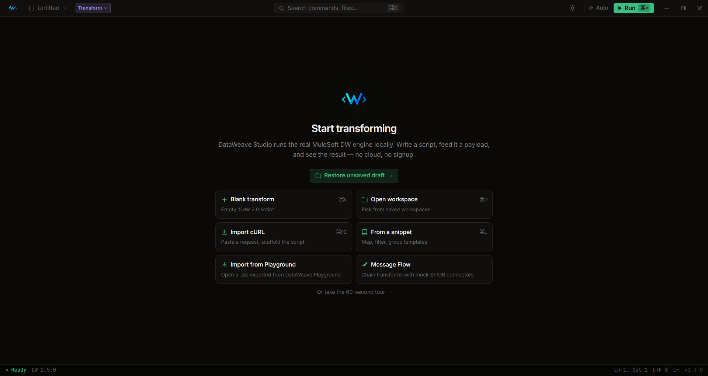
*Welcome screen: blank transform, open a workspace, import cURL, snippets or a message flow, each one click away*

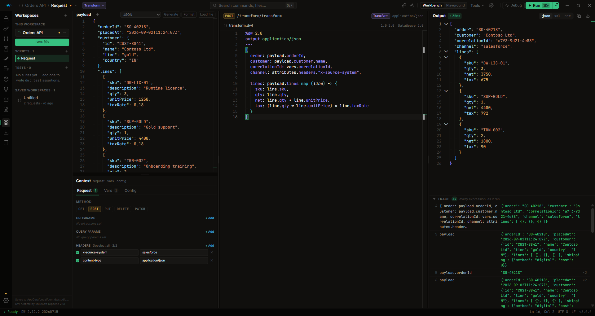
*Workbench: payload and context on the left, script in the middle, live output on the right*

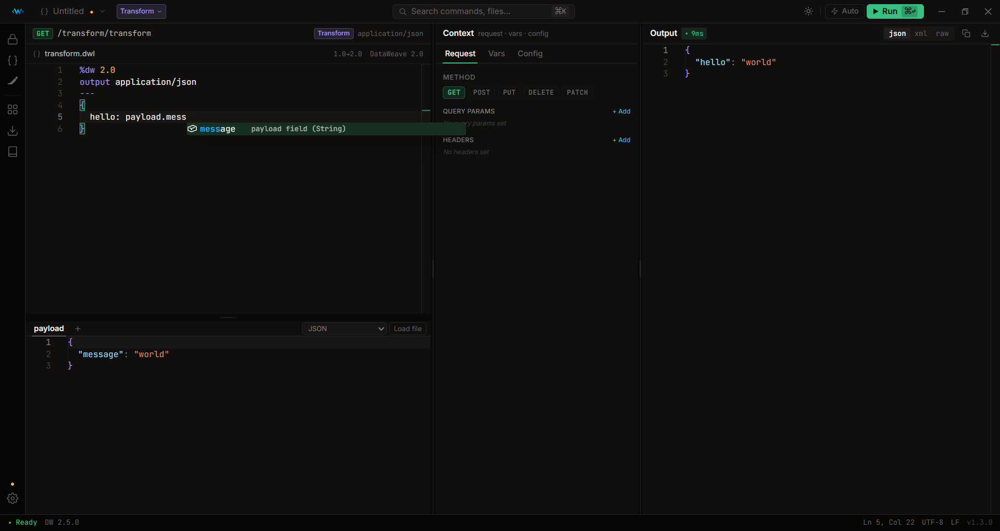
*Monaco editor with DataWeave highlighting, autocomplete for all 361 functions, signature hints and live output*

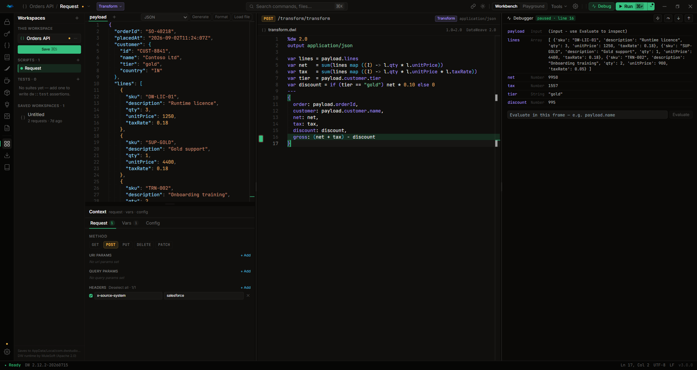
*Step debugger: click the gutter to set a breakpoint, then read the call stack, every variable in scope, and evaluate expressions against the paused frame*

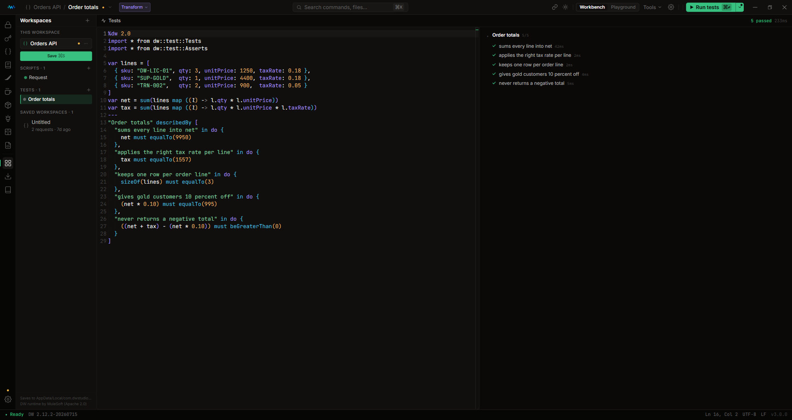
*Real `dw::test` suites, run by the bundled engine, with its own failure messages and per-test timings*

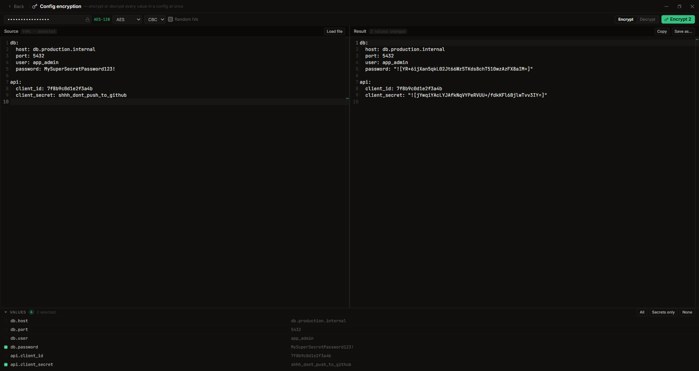
*Config encryption: encrypt every secret in a YAML or .properties file at once. Values already written as `![…]` are left alone and comments survive*

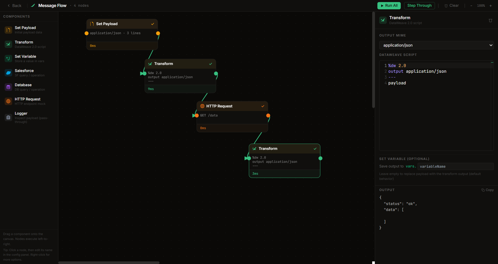
*Message Flow Designer: chain Set Payload, Transform, HTTP, Salesforce and Database steps, then step through them*

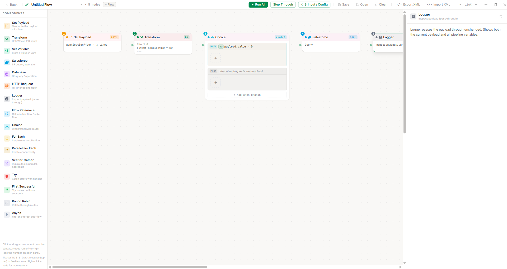
*The Flow Designer in the Paper (light) theme, with a Salesforce connector configured*

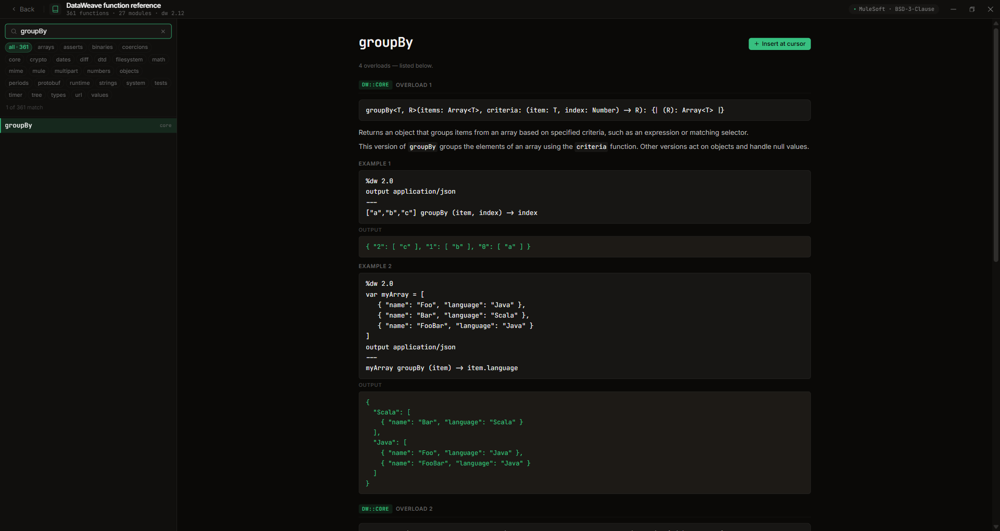
*Function reference: all 361 DataWeave functions, searchable, with signatures and descriptions*

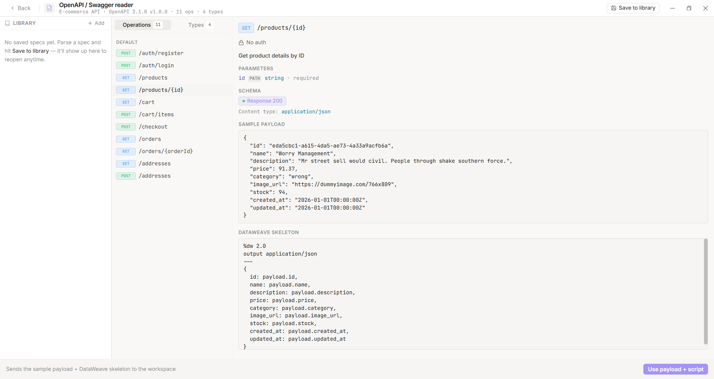
*OpenAPI / Swagger reader: open a 3.x or 2.0 spec, pick an operation, and get a sample payload plus a matching DataWeave skeleton*

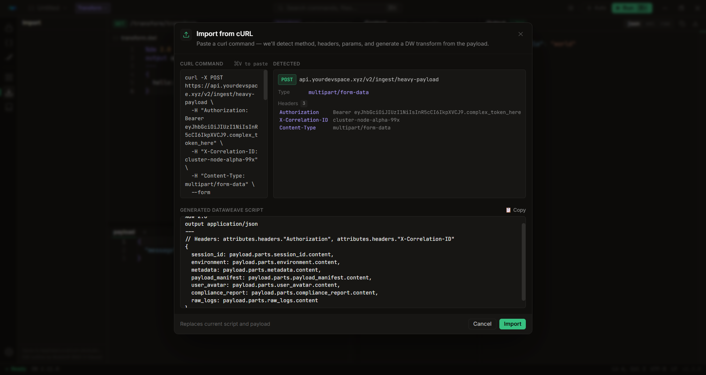
*cURL importer: paste a cURL command and the payload, headers and a matching transform are filled in*

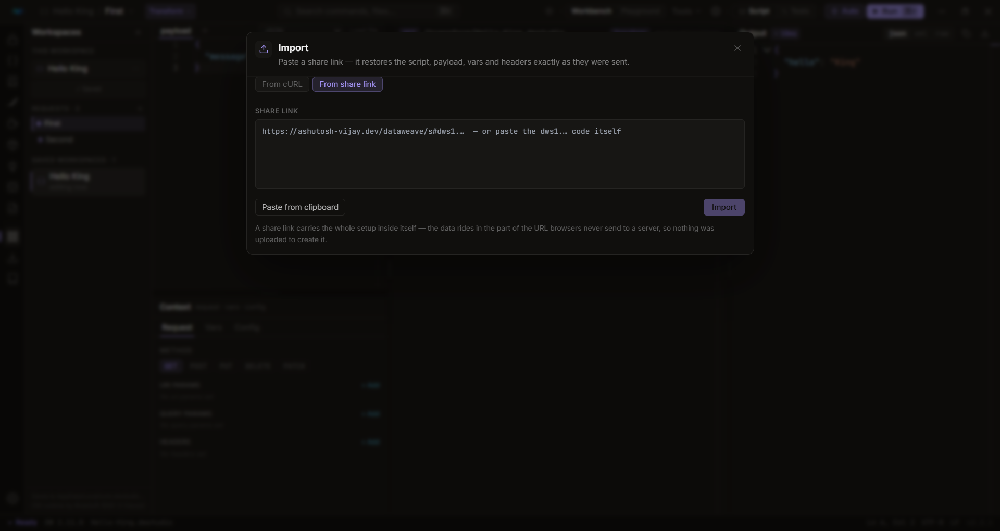
*Share links: paste a link and the whole setup comes back, including script, payload, variables and headers*

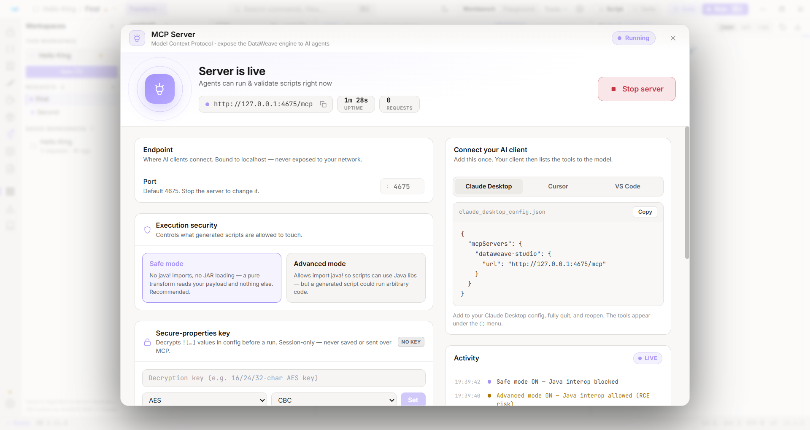
*Local MCP server: Claude, Cursor or VS Code can run transforms against the real engine*

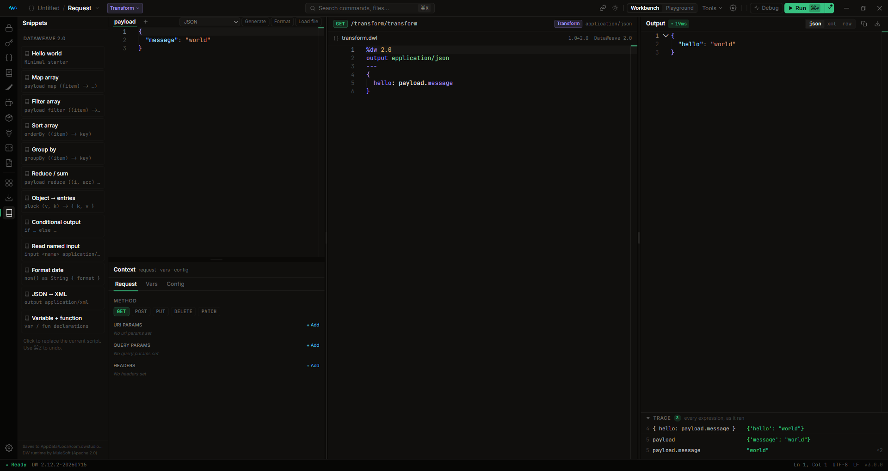
*Snippets: reusable templates for map, filter, group-by, reduce and more*

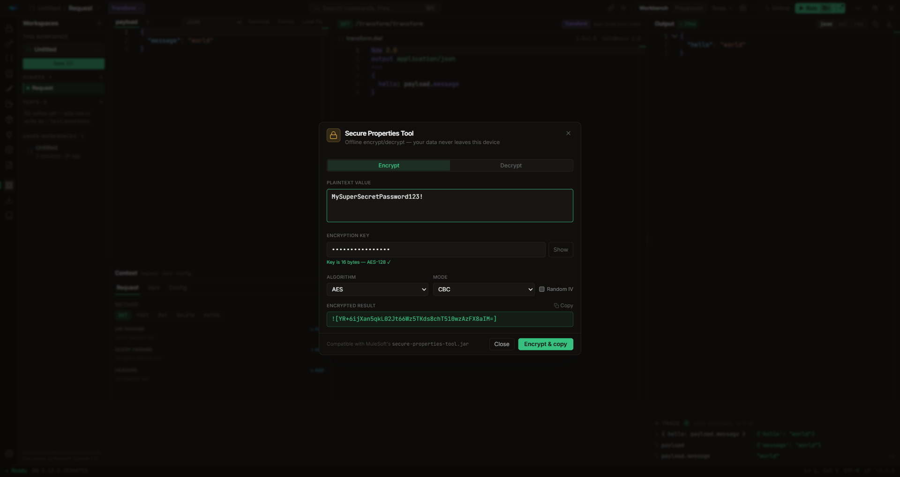
*Secure Properties Tool: encrypt and decrypt values with the same algorithms as MuleSoft's tool*

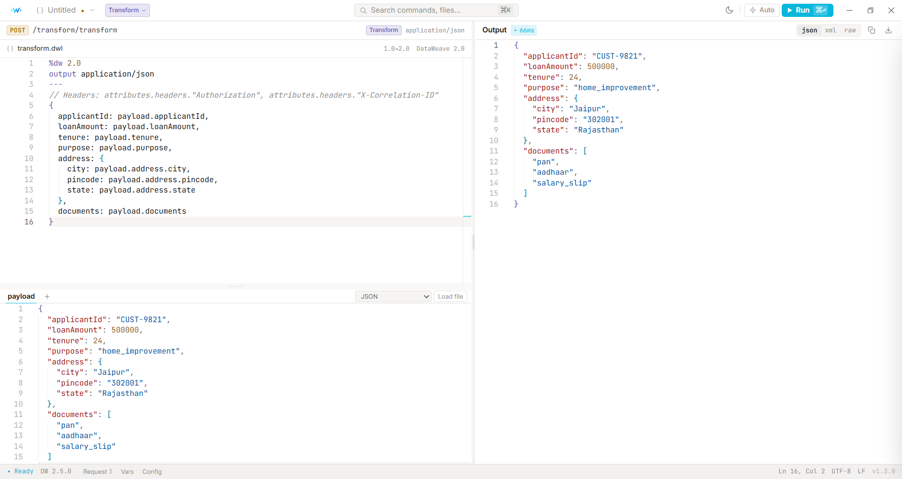
*Playground layout: a clean three-pane Input, Script, Output view*

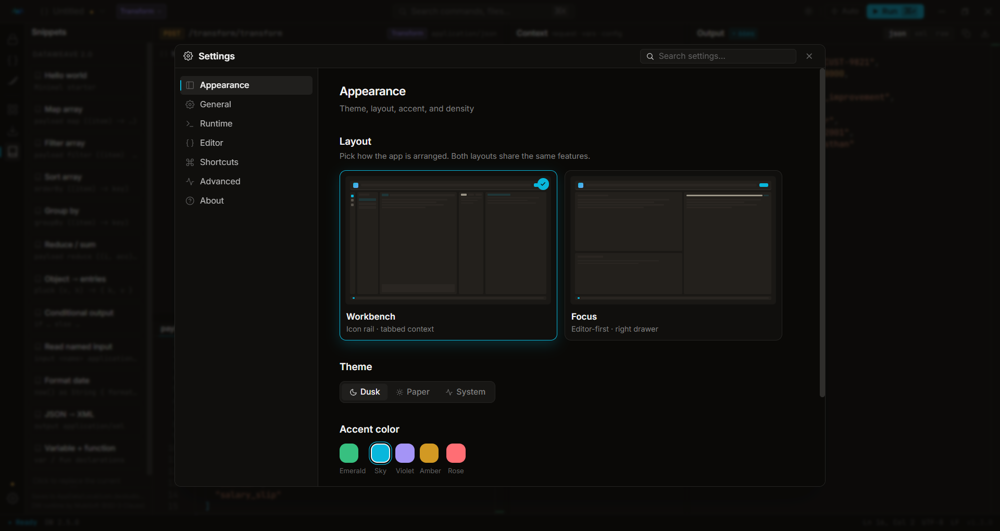
*Settings: Dusk and Paper themes, five accent colours, Workbench and Playground layouts*

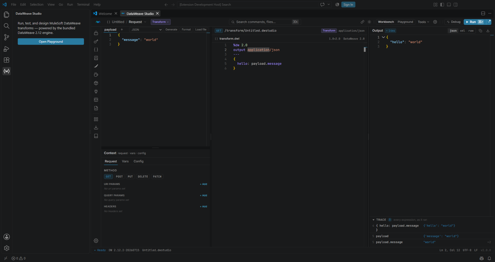
*The same app inside VS Code, with the same engine, the same Trace panel and the same ~20 ms runs*

---

## Why it exists

Testing DataWeave today means picking one of these:

- **Anypoint Studio** is a 2 GB Eclipse install that takes minutes to start, and testing one script means running a whole Mule app.
- **The online playground** runs in the browser. It has no offline mode, no binary formats (Excel, Avro, Protobuf), payloads are limited by browser memory, and there's no way to set `vars` or `attributes` properly.
- **MuleSoft's VS Code extension** needs Java 8+ and Maven 3.6+, a full Maven project (`pom.xml`, `src/main/dw/`, `src/test/dw/`) and scenario files for every input. *(DataWeave Studio's own extension has none of these requirements.)*

DataWeave Studio puts all of it in one window. Install it and start typing.

---

## What sets it apart

**1. Share a whole setup as one link**
Copy a link that carries the script, payload, variables, headers and query params, for one request or the whole workspace. Whoever opens it gets the same setup and can press Run. The hosted playground can't do this.

**2. A local MCP server**
Claude, Cursor or any MCP client can compile and run transforms against the real engine, so your assistant checks its DataWeave instead of guessing.

**3. Practice mode**
Hundreds of DataWeave problems, from your first `map` to exam-style multiple choice questions for the MuleSoft Developer certification. Every answer and explanation was run on the real engine before it shipped.

**4. Visual Message Flow Designer**
A drag-and-drop canvas inspired by Anypoint Studio. Chain Set Payload, Transform, Set Variable, HTTP Request, Salesforce, Database and Logger steps, then run them all or step through one node at a time and inspect the payload, variables and attributes at each stage.

**5. cURL importer**
Paste any `curl` command from Postman or your browser's devtools. Method, headers, query params and body are filled in, with a matching DataWeave scaffold for JSON, XML, CSV, form-urlencoded or multipart.

**6. Secure properties**
Paste your real `secure-config.yaml` with its `![Base64Encrypted...]` values, give the key when you run, and scripts see the decrypted values. There's also a standalone encrypt/decrypt tool (AES, Blowfish, DES, DESede, RC2) that matches MuleSoft's `secure-properties-tool.jar`, so you don't depend on a website that might be down or blocked.

**7. SOQL and SQL query modes**
Write a SOQL or SQL template with `:paramName` placeholders, run a script that produces the params, and see the final query. SQL values are quoted JDBC-style.

**8. Multi-request workspaces**
Postman-style collections. Each request in a `.dwstudio` workspace has its own script, payload, context, named inputs, tests and query template.

**9. DW 1.0 to 2.0 migration**
Rewrites legacy scripts in place, converting directives, `flowVars`, `inboundProperties` and type syntax, with a diff to review before you accept.

**10. Nothing to set up**
JRE 17 and the DataWeave runtime ship inside the app. No Java install, no `JAVA_HOME`, no Maven, no `PATH` changes.

---

## Compared with the alternatives

| Feature | DataWeave Studio | MuleSoft VS Code Ext | Online Playground | Anypoint Studio |
|---|---|---|---|---|
| **Setup** | Download and run | Java, Maven and a project | Open a browser | 2 GB download |
| **Startup time** | ~1-2 s first run, instant after | Depends on project indexing | Instant | Minutes |
| **Offline** | Yes | Yes | No | Yes |
| **Java required** | No (bundled JRE 17) | Yes (Java 8+ and Maven 3.6+) | No | Yes (bundled) |
| **Visual flow designer** | Yes | No | No | Yes |
| **cURL import** | Yes | No | No | No |
| **Breakpoint debugging** | Yes: breakpoints, call stack, watch, step in/over/out | Yes | No | Yes |
| **Every expression's value** | Yes, in the Trace panel | No | No | No |
| **Go to Definition / Rename** | Yes | Yes (LSP) | No | Yes |
| **Type inference** | Yes | Yes (LSP) | No | Yes |
| **Target an older Mule runtime** | Yes, 4.1 to 4.12 | No | No | Per project |
| **Autocomplete** | 361 functions plus fields from your payload | LSP, type-aware | Basic | Full LSP |
| **Context (vars, attributes, headers)** | Forms in the UI | JSON scenario files | Partial | Full runtime |
| **Config YAML (`${key}`)** | Yes | No | No | Yes |
| **Secure config (`![encrypted]`)** | Yes, one value or a whole file | No | No | Yes |
| **SOQL/SQL query rendering** | Yes | No | No | Yes |
| **Testing** | `dw::test`, run in the app | `dw::test` | No | MUnit |
| **Practice problems** | Yes, with explanations | No | Tutorials | No |
| **Multi-request workspaces** | Yes | One mapping per file | No | Per flow |
| **Multipart form-data** | Visual builder | No | No | Yes |
| **DW 1.0 to 2.0 migration** | Yes | No | No | Yes |
| **Binary formats (xlsx, avro)** | Yes | Yes (via Maven) | No | Yes |
| **Publish to Exchange** | No | Yes | No | Yes |
| **Dependency management** | Custom classpath | Maven | No | Maven |
| **Themes** | Dusk, Paper and 5 accents | VS Code themes | Dark | Dark |
| **Footprint** | ~90 MB | VS Code, Java and Maven | Browser | 2 GB+ |
| **Live preview** | Auto-run (toggle) | AutoPreview (opt-in) | Always on | No |
| **Execution time display** | Yes | No | No | No |
| **Cancel a running script** | Yes | No | No | No |
| **Share a setup as a link** | Yes | No | No | No |
| **MCP server for your AI assistant** | Yes, free and local | No | No | Vibes (subscription) |
| **HTTP API** | Yes, `POST /run` | No | No | No |
| **Configurable timeout** | Yes | No | No | No |

**In short:** it starts where the playground does, open it and type, and keeps going: real `vars` and `attributes`, payloads from disk, secure properties, a step debugger, `dw::test` suites and practice problems. It skips the Java and Maven setup of MuleSoft's extension and the 2 GB of Studio, and cURL import, the Flow Designer, share links and the MCP server are its own.

---

## Features

### Script editor
- DataWeave 2.0 syntax highlighting
- **Autocomplete for all 361 functions**, with signature hints and module grouping
- **Type-aware completion from the engine itself.** `payload.` lists the fields your payload actually has, and inside a `map` the lambda parameter knows the element type, so `item.` suggests that element's fields
- **Hover for inferred types**, and signature help that shows which argument you're on
- **Go to Definition** (F12), **Find All References** (Shift+F12) and **Rename Symbol** (F2), resolved through the engine's scope graph, so a shadowed name in an inner scope is left alone
- **Outline** (Ctrl+Shift+O) and code folding based on the parsed script
- **Live diagnostics**: a misspelled function, an undefined variable, a wrong argument count or a syntax error is underlined as you type
- When a run fails, the type checker's own explanation is shown next to the error
- Suggestions from your variables, attributes and config properties
- **Formatting** (Alt+Shift+F) with the engine's own formatter, plus a Format button for JSON and XML payloads
- Bracket pair colours, auto-closing brackets and quotes, smart indentation
- Configurable font, size, line height, tab size and word wrap

### Payload and inputs
- **14+ formats**: JSON, XML, CSV, YAML, NDJSON, plain text, form-urlencoded, DataWeave, Java properties, Excel, Avro, Protocol Buffers, flat files (COBOL copybooks) and binary
- Load a file into the payload
- **Named inputs** as extra tabs (for example `lookup`, `config` or `schema`), each with its own editor and format
- **Multipart form-data builder** with parts for name, content type, and text or file value
- Binary payloads with no size limit

### HTTP context
- HTTP method selector, exposed as `attributes.method`
- Query parameters and headers, each with an on/off toggle per row
- Variables with a type picker (string or JSON)

### Configuration
- **Config YAML**: paste `application.yaml`-style config and `${key}` placeholders resolve in the script and payload
- **Secure config YAML** with `![Base64Value]` values and `${secure::key}` placeholders
- Nested keys such as `${salesforce.username}`
- Encryption settings per workspace: algorithm, mode and random IV

### Secure Properties Tool
- Encrypt and decrypt dialog (Cmd/Ctrl+Shift+E)
- **5 algorithms**: AES, Blowfish, DES, DESede, RC2
- **4 modes**: CBC, CFB, ECB, OFB
- Random IV option for AES
- Compatible with MuleSoft's `secure-properties-tool.jar`

### Practice
- Build problems graded against hidden test cases, like LeetCode
- "Fix it" problems that start from a broken script
- Multiple choice questions written against the MuleSoft Certified Developer (Level 1) DataWeave objectives
- "What does this return?" cards: read the script, reveal the answer, mark whether you had it
- A short primer on each topic for people who are new to it, plus hints and a worked explanation
- Progress by level, an activity chart and a daily goal
- Filter by question type; Next stays within the filter
- Works offline, graded by the same engine that runs your scripts

### Message Flow Designer
- Drag-and-drop canvas for chaining steps
- **7 step types**: Set Payload, Transform, Set Variable, HTTP Request, Salesforce, Database, Logger
- Run everything at once or **step through** and inspect the payload, variables and attributes at each stage
- Variables carry through the pipeline
- Each step has its own editor with highlighting and autocomplete
- Disable steps without deleting them
- Zoom with Ctrl+scroll or the +/- buttons
- Saved with the workspace

### Sample data
No input to test with? If your script declares types, the **Generate** button builds a realistic payload from any of them. The engine's generator reads field names, so `email` gets a plausible address, `phone` a formatted number, `creditCard` a valid-looking card number and a `DateTime` a real timestamp. Preview it, re-roll it, then apply it.

### Target runtime
The bundled engine is DataWeave 2.12 (Mule 4.12). If you deploy to something older, a script can work here and fail there: `logInfo` needs 2.10, the `update` operator needs 2.3, and around 30 standard-library functions didn't exist in 2.4.

You pick your target once, when you set the app up, and change it any time from the status bar or **Settings → Runtime**. The default is "latest", which checks nothing. It's one setting for the whole app, because which Mule you deploy to is about you rather than one script. If you work across two runtimes, **Settings → Runtime** has a per-workspace option.

With a target set:

- **Functions and syntax newer than the target become errors**, and the message names the version that introduced them. This uses the same `@Since` metadata as MuleSoft's runtime
- **Behaviour that changed between versions reverts too.** For example, `[3, "a", true] orderBy $` fails with `InvalidComparisonException` on 2.12 but `InvalidBooleanException` on 2.9
- It applies to Run, the Tests panel and live diagnostics, so you see problems while typing
- It travels in share links, so "this breaks on 4.4" can be reproduced by whoever opens the link (if they've turned on per-workspace targets)

The `%dw 2.4` header doesn't do this. The runtime only checks it against its own version, so the target is a separate setting.

### Query modes
- **Salesforce (SOQL)** with `:paramName` placeholders bound from your script's output, and the final query shown
- **Database (SQL)** with `:paramName` placeholders and JDBC-style quoting (strings quoted, numbers bare, `null` becomes `NULL`)
- Switching between Transform, SOQL and SQL keeps each mode's script

### Testing
- **Real `dw::test` suites**, run by the bundled engine. This is MuleSoft's framework, and `dw::test::Tests`, `dw::test::Asserts` and `dw::io::file` are built in
- Named assertions with the engine's own failure messages, such as `Expected value to be 3 but was 2`
- **Per-test status and timing**, with nested `describedBy` blocks shown as a tree
- **Line numbers on failures**
- Suites are ordinary DataWeave and run through the same path as the Run button

> `dw::test` tests **functions**, so a suite defines what it tests inline or imports it from the Module library. Older builds had a snapshot runner here instead; snapshot data in existing workspaces is kept but no longer used.

### cURL importer
- Paste any `curl` command from Postman, browser devtools or anywhere else
- Method, headers, query params and body are extracted
- Detects JSON, XML, CSV, form-urlencoded and multipart bodies
- Generates a matching DataWeave scaffold
- Handles multipart `-F` flags, including part names, types and file paths
- Preview before importing

### OpenAPI / Swagger reader
- Open or paste an **OpenAPI 3.x** or **Swagger 2.0** spec in JSON or YAML
- Browse operations by tag, plus the reusable types
- Resolves `$ref`s, `allOf`/`oneOf`/`anyOf`, enums and formats, and shows auth, servers, webhooks and callbacks
- Pick any request, response or named example to get a sample payload and a DataWeave skeleton
- **Spec library**: save specs you use often and reopen them from the sidebar

### Share links
- **Copy a whole runnable setup as one link**: script, payload and format, variables, headers, query params, method, named inputs and multipart parts
- Share **one request** or **the whole workspace**
- Paste a link back under **Import → From share link** (Cmd/Ctrl+Shift+I)
- If something can't go in a link (anything backed by a file on disk), the copy confirmation says so
- Very large payloads are pointed at the Playground zip export instead
- Opening a link in a browser shows a preview of every request, so someone without the app still sees something useful

### Local MCP server
- Serves the **Model Context Protocol** over HTTP on `127.0.0.1`, so Claude, Cursor or any MCP client can use the real engine
- Tools for validating and running DataWeave, so an assistant **checks** its transform before handing it to you
- Starts only when you start it, from the MCP panel in the left rail
- Safe mode rejects `java!` imports, and custom modules sent by a client are scanned before use
- **Plain HTTP on the same port** (`POST /run`) when you want the engine without an MCP client:
  ```bash
  curl -X POST http://127.0.0.1:4675/run -H 'Content-Type: application/json' \
    -d '{"script":"%dw 2.0\noutput application/json\n---\n{ n: sizeOf(payload) }","payload":[1,2,3]}'
  ```
  Send a `rows` array instead of `payload`/`vars` to run **one script over many inputs** and get one result per row, for example to back-test a transform against a CSV export. The script compiles once, so the first row takes about a second and the rest about 15 ms each.

### Recipes and cookbook
- Searchable recipes that open into a workspace with the payload and variables already filled in
- Includes **MuleSoft's official cookbook examples**, generated from `mulesoft/docs-dataweave` (BSD-3)
- Every recipe was **run against the bundled engine** and kept only if it works, with the engine's output as the expected result
- `npm run docs:refresh` pulls the reference, format options and cookbook again from the docs branch that matches the bundled engine

### Compare
- Side-by-side diff of two payloads or two flow XMLs
- **Ignore IDs** blanks `doc:id` and UUID values on both sides, so Anypoint Studio's id churn doesn't hide the real change
- Normalize and swap helpers

### Java interop and custom modules
- **Java tester**: paste or pick `.java` sources, compile and run them on the bundled JRE, and call them from DataWeave with `import java!`
- Add your own JARs to the engine's classpath
- **Module library**: write reusable `.dwl` modules and `import x from MyModule` across workspaces

### Workspaces
- **`.dwstudio` files** holding the full project state
- **Several requests per workspace**, Postman-style
- Each request keeps its script, payload, context, named inputs, query template, classpath, timeout and tests
- Save, load, duplicate, delete and pin workspaces
- Reopens your last workspace on launch
- Drafts are saved as you type

### Snippets
12 built-in templates: hello world, map, filter, sort, group by, reduce/sum, pluck, conditional output, reading a named input, date formatting, JSON to XML, and variables with functions. Click one to insert it at the cursor.

### Function reference
All 361 DataWeave functions with signatures, descriptions and modules. Click one to insert it at the cursor.

### DW 1.0 to 2.0 migration
Rewrites legacy scripts in place, converting `%dw 1.0` directives, `flowVars`, `inboundProperties` and type syntax. A side-by-side diff lets you review the changes before you accept.

### Execution engine
- **A long-running Java server** instead of a CLI process per run, so a run takes ~10-50 ms once warm
- Compiled scripts are cached, so repeated runs skip compilation
- The JVM warms up while the splash screen shows
- Per-run timeout (default 30 s, 0 for none)
- Cancel a running script
- Run time shown in milliseconds
- Custom classpath for `import java!`

### Output
- Syntax-highlighted output
- JSON, XML or raw text view
- Errors show the DataWeave error code, a headline, details and a collapsible stack trace
- Error line numbers match your script
- Copy to clipboard or save to a file

### Appearance and layout
- **Dusk** (dark) and **Paper** (light) themes
- **5 accent colours**: Emerald, Sky, Violet, Amber, Rose
- **Workbench layout**: sidebar plus the Input/Context, Script and Output panes, with resizable splits and a Tests view
- **Playground layout**: the same three panes without the sidebar, like the online playground
- Compact mode for narrow windows
- Custom title bar

### Command palette and shortcuts
Every action is available from **Cmd/Ctrl+K**, grouped into Run, Workspace, Editor, View, Output, Node Label and Tools.

---

## Keyboard shortcuts

| Shortcut | Action |
|---|---|
| `Ctrl+Enter` / `Cmd+Enter` | Run script |
| `Ctrl+S` / `Cmd+S` | Save workspace |
| `Ctrl+K` / `Cmd+K` | Command palette |
| `Ctrl+N` / `Cmd+N` | New workspace |
| `Ctrl+O` / `Cmd+O` | Open workspace |
| `Ctrl+D` / `Cmd+D` | Duplicate workspace |
| `Ctrl+B` / `Cmd+B` | Toggle sidebar |
| `Ctrl+L` / `Cmd+L` | Snippets |
| `Ctrl+Shift+I` / `Cmd+Shift+I` | Import |
| `Ctrl+Shift+E` / `Cmd+Shift+E` | Secure Properties Tool |
| `Ctrl+Shift+R` / `Cmd+Shift+R` | Toggle auto-run |
| `Ctrl+Shift+T` / `Cmd+Shift+T` | Toggle theme |
| `Ctrl+Shift+1` / `Cmd+Shift+1` | Workbench layout |
| `Ctrl+Shift+2` / `Cmd+Shift+2` | Playground layout |
| `Alt+Shift+F` | Format script |
| `Ctrl+.` / `Cmd+.` | Cancel running script |
| `Ctrl+/` / `Cmd+/` | Show shortcuts |
| `Escape` | Close dialogs |

---

## Installation

**On Windows, the [Microsoft Store](https://apps.microsoft.com/detail/9NWD4L4J7D92) is the easiest option.** Microsoft signs the package, so there's no SmartScreen prompt or Smart App Control block, and updates come through the Store.

Otherwise, download the latest installer from the **[website](https://ashutosh-vijay.dev/dataweave/)** or the [Releases page](https://github.com/Ashutosh-Vijay/DataWeave-Studio/releases):

- **Windows**: `.exe` (installer), `.msi`, `_x64_portable.zip` (no install, unzip and run), or `_x64-setup.zip` (the installer, zipped, for networks that block `.exe` downloads)
- **macOS**: `.dmg` for Apple Silicon and Intel
- **Linux**: `.AppImage`, `.deb` or `.rpm`

> **The direct downloads aren't code-signed** (the Store build is). Signing costs about $99 a year for Apple and $300+ for a Windows EV certificate, which is a lot for a free side project, so your OS will warn about an unverified publisher on first launch. [SECURITY.md](SECURITY.md) describes exactly what the app does on your network.
>
> **Windows, "Windows protected your PC" (SmartScreen):** click **More info → Run anyway**.
>
> **Windows, "Smart App Control has blocked this app":** use the **`_x64_portable.zip`** instead (unzip anywhere and run `DataWeave Studio.exe`). Smart App Control can't be bypassed for a single app without turning it off.
>
> **Windows, "Your system administrator has prevented this install" (work laptop):** that policy applies to installers, so try the **`_x64_portable.zip`**. If your IT also blocks unapproved `.exe` files, they'll need to allow it, or use the VS Code extension.
>
> **macOS, "is damaged and can't be opened":** this is the quarantine flag on unsigned apps.
> 1. Drag **DataWeave Studio** into **Applications**.
> 2. Open **System Settings → Privacy & Security**, scroll down, click **Open Anyway**, then confirm on the next launch.
> 3. If it still won't open, clear the quarantine flag:
>    ```bash
>    xattr -cr "/Applications/DataWeave Studio.app"
>    ```
> *(On macOS Sequoia and later, the old right-click → Open trick no longer works for unsigned apps.)*

**Updates:** the desktop app checks for a new version on startup and shows a notice when there is one. Nothing downloads until you click. You can turn the check off in **Settings → Advanced → Privacy**.

---

## Privacy

DataWeave Studio has no account, telemetry or analytics, and your scripts run on the bundled engine. The standalone desktop app's update check is counted by version and platform (the Store and VS Code versions don't make one), and in-app feedback is sent only when you choose to send it. The [privacy policy](https://ashutosh-vijay.dev/dataweave/privacy) has the details, and [SECURITY.md](SECURITY.md) lists every network connection for security reviewers.

---

## Development setup

```bash
# 1. Install dependencies
npm install

# 2. Build the DW server JAR (needs Maven and JDK 17)
cd dw-server && mvn package && cd ..
# Produces src-tauri/resources/dw-server/dwstudio-server.jar

# 3. Set up a JRE in resources (for development, link your system JDK)
#    Production builds use jlink to create a minimal JRE

# 4. Run in development mode
npx tauri dev

# 5. Build for production
npx tauri build
```

---

## Architecture

DataWeave Studio doesn't start the MuleSoft CLI for each run. Instead:

1. On first launch, the Rust backend starts a **long-running Java server** (`dwstudio-server.jar`) on the bundled JRE 17
2. The server loads the DataWeave runtime libraries once
3. Each run is a **JSON request and response over stdin/stdout**
4. Compiled scripts are cached, so repeated scripts skip compilation
5. The result is ~10-50 ms per run once warm, against ~700 ms with the CLI

The **VS Code extension uses the same protocol.** Its Node host (`vscode-extension/src/dwHost.ts`) starts the same `dwstudio-server.jar`, so a script behaves the same in both. A small `src/bridge.ts` sends the UI's `invoke()` calls to Tauri on the desktop and to the extension host in VS Code, which is how one React codebase serves both.

---

## Project structure

```
src/                        # React frontend
  components/               # UI components
    FlowDesigner.tsx        # Message flow designer canvas
    PracticeScreen.tsx      # Practice mode
    Sidebar.tsx             # Icon rail with snippets, tools and settings
  hooks/                    # useDWRunner, useWorkspace, useEditorFont
  dataweaveGrammar.ts       # Syntax highlighting
  dataweaveCompletions.ts   # Function autocomplete
  dataweaveDocs.ts          # Function reference data
  dataweaveTheme.ts         # Dusk and Paper editor themes
  bridge.ts                 # Routes invoke() to Tauri or the VS Code host
src-tauri/                  # Rust backend (desktop)
  src/dw_runner.rs          # Script execution
  src/dw_server.rs          # Starts and manages dwstudio-server.jar
  src/workspace.rs          # Workspace save/load
  resources/dw-server/      # Bundled dwstudio-server.jar
  resources/jre/            # Bundled minimal JRE 17
vscode-extension/           # VS Code extension, reusing the React UI
  src/extension.ts          # Extension host: the Tauri commands, in Node
  src/dwHost.ts             # Starts dwstudio-server.jar
dw-server/                  # Scala/Java engine server (Maven)
scripts/practice/           # Practice question pipeline and verifier
licenses/                   # Third-party licences
```

---

## Known limitations

- The first launch starts the DataWeave runtime, which takes 1-2 seconds behind the splash screen. Runs after that take ~10-50 ms.
- Undo and redo don't persist across workspace reloads.
- Config property suggestions appear when you type `${`.
- Trackpad pinch-to-zoom in the Flow Designer is limited by WebView2; use Ctrl+scroll or the +/- buttons.
- No extract-variable or extract-function refactors.
- No Anypoint Exchange publishing or Maven dependency management.

**Things that work that you might not expect:**

- `import java!java::lang::Math`, `import java!java::util::UUID` and any other standard JDK class, because the runtime is a real JVM.
- Secure config (`![encrypted]`) without the Mule runtime.
- Adding JARs to the classpath takes effect immediately, without a restart.

**Features that only exist inside a running Mule app:**

| Feature | What to do instead |
|---|---|
| `p("key")` / `Mule::p("key")` | Use the **Config YAML** panel; `${key}` is substituted before each run |
| `Mule::lookup("flowName", payload)` | No equivalent; move the logic into a named input or a separate script |
| Connector types (Salesforce `SObject`, DB `ResultSet`) | Use a JSON mock of the data as the payload |

> `output application/java` works. The Java object is shown as JSON so you can see its structure.

---

## Third-party licences

This application embeds the DataWeave engine published by MuleSoft/Salesforce to `repository.mulesoft.org` (`parser`, `runtime`, `core-modules`, `java-module`, `yaml-module`, `tooling-api` and related modules, pinned at `2.12.2-20260715`). Those artifacts declare the **Apache License 2.0**. The licence text is in [licenses/DATAWEAVE-ENGINE-LICENSE.txt](licenses/DATAWEAVE-ENGINE-LICENSE.txt) and the attribution notices in [licenses/DATAWEAVE-ENGINE-NOTICE.txt](licenses/DATAWEAVE-ENGINE-NOTICE.txt).

`excel-module`, which handles `application/xlsx` payloads, declares MuleSoft's Main Services Agreement rather than an open-source licence.

The function reference, format options and cookbook are generated from [`mulesoft/docs-dataweave`](https://github.com/mulesoft/docs-dataweave) (BSD 3-Clause). See [licenses/docs-dataweave-LICENSE.txt](licenses/docs-dataweave-LICENSE.txt) and [licenses/mulesoft-cookbook-LICENSE.txt](licenses/mulesoft-cookbook-LICENSE.txt).

DataWeave Studio is not affiliated with, endorsed by or sponsored by MuleSoft or Salesforce. DataWeave, Mule, MuleSoft and Anypoint are trademarks of their respective owners, used here only to describe what this tool works with.

The MIT licence covers the **source code**. It doesn't cover the **name** "DataWeave Studio", its logo or its visual identity. You're free to fork it, sell it and build on it, as long as you keep the copyright notice. Please ship it under your own name rather than one that suggests it came from here.
